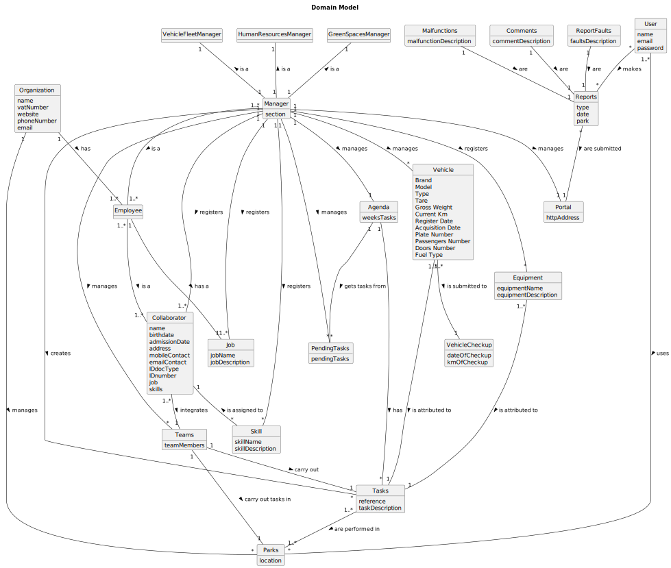

 # OO Analysis

The construction process of the domain model is based on the client specifications, especially the nouns (for _concepts_) and verbs (for _relations_) used.

## Rationale to identify domain conceptual classes
To identify domain conceptual classes, start by making a list of candidate conceptual classes inspired by the list of categories suggested in the book "Applying UML and Patterns: An Introduction to Object-Oriented Analysis and Design and Iterative Development".

### _Conceptual Class Category List_

**Business Transactions**

* Tasks

---

**Transaction Line Items**

* Plant material
* Urban furniture
* Irrigation systems
* Drinking fountains
* Lightning systems
* Rainwater conduction systems
* Drainage systems
* Vehicles?
* Machines?
* Equipment?

---

**Product/Service related to a Transaction or Transaction Line Item**

* Planning green spaces
* Construction of green spaces
* Maintenance of green spaces

---

**Transaction Records**

* 

---  

**Roles of People or Organizations**

* Employee
* Collaborators
* Human Resources Manager
* Vehicle and Equipment Fleet Manager
* Green Spaces Manager
* Green Spaces User

---

**Places**

* Green spaces
* Gardens
* Medium-sized parks
* Large-sized parks

---

**Noteworthy Events**

* Carrying out tasks

---

**Physical Objects**

* Vehicles
* Equipment

---

**Descriptions of Things**

* ?
* Green Spaces for Collective Use
* System Users
* Machines

---

**Catalogs**

* Jobs
* Skils

---

**Containers**

* Teams
* Pending tasks (To-do list)
* Agenda
* Parks
* Reports

---

**Elements of Containers**

* Collaborators
* Tasks
* Gardens
* Medium-sized parks
* Large-sized parks
* Reported faults
* Reported malfunctions
* Comments

---

**Organizations**

* Musgo Sublime

---

**Other External/Collaborating Systems**

* Green Spaces User Portal

---

**Records of finance, work, contracts, legal matters**

* Pending tasks (To-do list)
* Agenda

---

**Financial Instruments**

* 

---

**Documents mentioned/used to perform some work/**

* Reported faults
* Reported malfunctions
* Comments

---

## Rationale to identify associations between conceptual classes

An association is a relationship between instances of objects that indicates a relevant connection and that is worth of remembering, or it is derivable from the List of Common Associations:

- **_A_** is physically or logically part of **_B_**
- **_A_** is physically or logically contained in/on **_B_**
- **_A_** is a description for **_B_**
- **_A_** known/logged/recorded/reported/captured in **_B_**
- **_A_** uses or manages or owns **_B_**
- **_A_** is related with a transaction (item) of **_B_**
- etc.

| Concept (A)       |     Association      |               Concept (B) |
|-------------------|:--------------------:|--------------------------:|
| Organisation (MS) |       manages        |              Green spaces |
| Organisation (MS) |         has          |                  Employee |
| Employee          |         is a         |              Collaborator |
| Manager           |         is a         |                  Employee |
| Manager           |      registers       |                    Skills |
| Manager           |      registers       |                      Jobs |
| Manager           |      registers       |                 Equipment |
| Manager           |       defines        |                     Teams |
| Manager           |      registers       |                  Vehicles |
| Manager           |      registers       |         Vehicle's checkup |
| Manager           |         list         |  Vehicles needing checkup |
| Manager           |       manages        |              Green spaces |
| Manager           |      registers       |             Collaborators |
| Skills            |   are assigned to    |             Collaborators |
| Employee          |        has a         |                       Job |
| Vehicles          |    are needed to     |                     Tasks |
| Vehicles          |      transport       |      Equipment (to tasks) |
| Collaborator      |     carries out      |                     Tasks |
| Teams             | are associations of  | Employees (Collaborators) |
| Teams             |      carry out       |                     Tasks |
| Teams             |  carry out tasks in  |              Green spaces |
| Agenda            | each entry defines a |                      Task |
| Agenda (Task)     |    previously on     |                To-do list |
| Tasks             |  are carried out in  |              Green spaces |
| User              |         uses         |              Green Spaces |
| User              |         post         |                  Comments |
| User              |        report        |                    Faults |
| User              |        report        |              Malfunctions |

## Domain Model

**Do NOT forget to identify concept atributes too.**

**Insert below the Domain Model Diagram in a SVG format**

