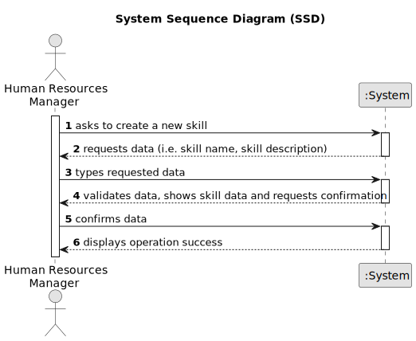

# US01 - As a Human Resources Manager (HRM), I want to register skills that may be appointed to a collaborator. 

## 1. Requirements Engineering

### 1.1. User Story Description

As a Human Resources Manager (HRM), I want to register skills in the system. These skills may be appointed to a new or existing collaborator, and they may be such as driving vehicles of different types (e.g. light, or heavy), operating machines such as backhoes or tractors, tree pruning, application of phytopharmaceuticals.

### 1.2. Customer Specifications and Clarifications 

**From the specifications document:**

>	"An employee has a main occupation (job) and a set of skills that enable him to perform/take on certain tasks/responsibilities, for example, driving vehicles of different types (e.g. light, or heavy), operating machines such as backhoes or tractors; tree pruning; application of phytopharmaceuticals."

>	"When creating multipurpose teams, the number of members and the set of skills that must be covered are crucial."

>   These excerpts are important as they highlight the importance of the "skills" in the project as well they can indicate the dependencies involved with this user story.

> "Human Resources Manager (HRM) - a person who manages human resources and defines teams based on the needs of ongoing projects and the skills of the employees."
 
> One again, this excerpt is of great importance, since the HRM will be the actor responsible for registering new skills as we are about to see in the next paragraph.

>   "US04 - As an HRM, I want to assign one or more skills to a collaborator." - This means that skills must stay registered in the system, so they can be accessed and assigned to a collaborator.

**From the client clarifications:**

> **Question:** Which data should be requested to the user?
>
> **Answer:** The main focus should be the "skill name", but a short description is also pertinent.

> **Question:** Which fields are for mandatory fulfilment?
>
> **Answer:** The "skill name"

### 1.3. Acceptance Criteria

* **AC1:** A Skill must be created.
* **AC2:** All required fields must be filed in (i.e. Skill name).
* **AC3:** When the skill is added to the system, a message should be displayed.

### 1.4. Found out Dependencies

* There is no dependencies of this US, however, "US04 - As an HRM, I want to assign one or more skills to a collaborator." will depend on this one as it is necessary to be implemented in order to assign the "skills".

### 1.5 Input and Output Data

**Input Data:**

* Typed data:
    * skill name
    * skill description

**Output Data:**

* (In)Success message of the operation
* List of existing skills

### 1.6. System Sequence Diagram (SSD)

### 1.7 Other Relevant Remarks

* "Skills" have a relation of "many" to 1 with "Collaborators"