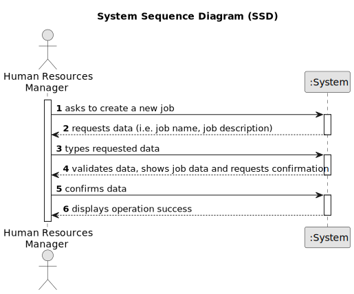

# US02 - As an HRM, I want to register a job.

## 1. Requirements Engineering

### 1.1. User Story Description

As a Human Resource Manager, I want to register a job. These can be designer, estimator, gardener, electrician, bricklayer, etc.

### 1.2. Customer Specifications and Clarifications 

**From the specifications document:**

> "MS has a wide range of employees who carry out the most varied tasks in the context of managing green spaces. Some job examples are designer, estimator, gardener, electrician or bricklayer." - This highlights the context in witch "jobs" can be important, as well it gives examples of the jobs themselves.
 
> "Human Resources Manager (HRM) - a person who manages human resources and defines teams based on the needs of ongoing projects and the skills of the employees."

> One again, this excerpt is of great importance, since the HRM will be the actor responsible for registering new jobs as we are about to see in the next paragraph.

> "US03 - As an HRM, I want to register a collaborator with a job and fundamental characteristics." - This means that jobs must stay registered in the system, so they can be accessed when registering a new collaborator.

**From the client clarifications:**

> **Question:** Which data should be requested to the user?.
>
> **Answer:** The main focus should be the "job title", but a short description is also pertinent.

> **Question:** Which fields are for mandatory fulfilment?
>
> **Answer:** The "job title".

### 1.3. Acceptance Criteria

* **AC1:** A Job must be created.
* **AC2:** All required fields must be filed in (i.e. Job title).

### 1.4. Found out Dependencies

* There is no dependencies of this US, however, "US03 - As an HRM, I want to register a collaborator with a job and fundamental characteristics." will depend on this one as it is necessary to be implemented in order for the system to be able to provide "job title" options when creating a new collaborator.

### 1.5 Input and Output Data

**Input Data:**

* Typed data:
    * Job title
    * Job description

**Output Data:**

* List of existing jobs
* (In)Success message of the operation

### 1.6. System Sequence Diagram (SSD)

### 1.7 Other Relevant Remarks

* "Job titles" have a relation of 1 to 1 with "Collaborators"