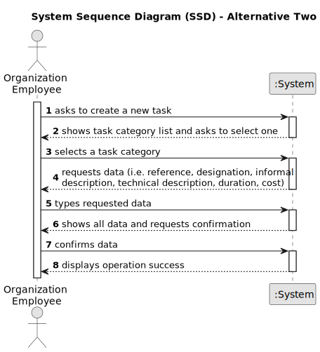

# US03 - As an HRM, I want to register a collaborator with a job and fundamental characteristics.
 

## 1. Requirements Engineering

### 1.1. User Story Description

As an HRM, I want to register a collaborator with a job, such as designer, estimator, gardener, electrician or bricklayer and fundamental
characteristics like name, birthdate, ID number and contact.
### 1.2. Customer Specifications and Clarifications 

**From the specifications document:**

>	"Some job examples are designer, estimator, gardener, electrician
or bricklayer."
- Jobs specified by the client.
 
>	

**From the client clarifications:**

> **Question:** Which characteristics are considered "fundamental characteristics"?
>
> **Answer:** Name, profession, ID number, Social Security number, NIF, tax identification number, birthdate, Job start date, emergency contact, e-mail, phone nr and address.

> **Question:** Which data is necessary to register the collaborator?
>
> **Answer:** Name, birthdate, ID number, contact, profession and tax identification number.

### 1.3. Acceptance Criteria

* **AC1:**  AC1: name, birthdate, admission date, address, contact info (mobile and
  email), ID doc type and respective number should be provided by HRM.
* **AC2:** A job must be chosen from the list of jobs available.
* **AC3:** The Fundamental characteristics should be able to be altered or incremented through time.
* **AC4:** A success or an error message must be presented at the end of the process.
* **AC5:** The Tax Identification number must be an integer with nine digits.
* **AC6:** All the numbers inserted by the HRM must be positive Integers.
* **AC7:** The Birthdate must be validated to assure that the collaborator is over eighteen years old.

### 1.4. Found out Dependencies

* There is a dependency on "US02 - As an HRM, I want to register a job." as there must be at least one job for the HRM to choose when register a collaborator.

### 1.5 Input and Output Data

**Input Data:**

* Typed data:
    * Name
    * Birthdate 
    * ID Number
    * Contact
    * Profession

**Output Data:**
* (In)Success message 

### 1.6. System Sequence Diagram (SSD)

**_Other alternatives might exist._**

#### Alternative One

#### Alternative Two

### 1.7 Other Relevant Remarks

* The created task stays in a "not published" state in order to distinguish from "published" tasks.