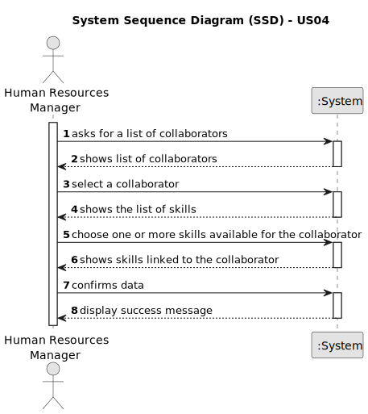

# US04 - As an HRM, I want to assign one or more skills to a collaborator.

## 1. Requirements Engineering

### 1.1. User Story Description

As an HRM, I want to assign one or more skills, such as driving vehicles of different types, operating machines such as backhoes or tractors, tree pruning or application of phytopharmaceutics to a collaborator.
### 1.2. Customer Specifications and Clarifications 

**From the specifications document:**

> "Thus, an employee has a main occupation (job) and
a set of skills that enable him to perform/take on certain tasks/responsibilities, for example, driving vehicles of different types (e.g. light, or heavy), operating machines such
as backhoes or tractors; tree pruning; application of agriculture phytopharmaceuticals."

> This part of the specifications is important because
we can find the skills specified by the client.

>  " US01 - As a Human Resources Manager (HRM), I want to register skills that a
collaborator may have." 

> This means that Skills must be registered before, and stay registered, for the HRM to assign them to a collaborator.

> "Human Resources Manager (HRM) - a person who manages human resources
and defines teams based on the needs of ongoing projects and the skills of the
employees."

> The HRM is the actor responsible for assigning skills to a collaborator.  
	

**From the client clarifications:**

> **Question:** Can skills only be assigned to a collaborator one time?
>
> **Answer:** They can be assigned throughout a collaborator career.

### 1.3. Acceptance Criteria

* **AC1:** Skills selected must be assigned to a collaborator.
* **AC2:** Skills must be chosen from the list of skills already created.
* **AC3:** At least one Skill must be assigned to a collaborator.
### 1.4. Found out Dependencies

* There is a dependency on "US01 - As a Human Resources Manager (HRM), I want to register skills that may be appointed to a collaborator." as there must be at least one skill for the HRM to choose.

### 1.5 Input and Output Data

**Input Data:**
* Selected data:
    * Skill(s)
  
**Output Data:**
* Collaboration data with the assigned skills

### 1.6. System Sequence Diagram (SSD)

