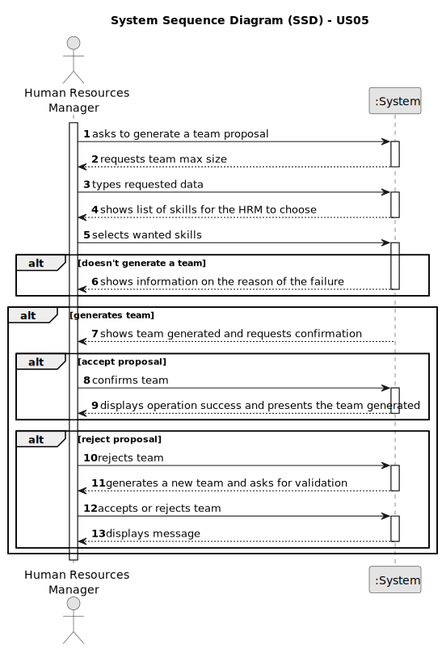

# US05 - As an HRM, I want to generate a team proposal automatically

## 1. Requirements Engineering

### 1.1. User Story Description

As a Human Resources Manager, I want to streamline the creation of proposals for highly-functional, versatile teams which collaborators need to have the skill set to perform the tasks properly.

### 1.2. Customer Specifications and Clarifications

**From the specifications document:**

>   "Human Resources Manager (HRM) - a person who manages human resources and defines teams based on the needs of ongoing projects and the skills of the employees."
>   Person who will automatise the generation of the teams.

>	"Teams are temporary associations of employees who will carry out a set of tasks in one or more green spaces."
>   Teams definition.

>   "When creating multipurpose teams, the number of members and the set of skills that must be covered are crucial."
>   Diversity of the teams to perform the tasks properly.

**From the client clarifications:**

> **Question:** What information will the customer provide?
>
> **Answer:** The customer provides the max size of the team and a set of skills.

> **Question:** Should teams be static?
>
> **Answer:** No, we must be able to define teams without being static, and can be changed depending on the tasks.

> **Question:** Is HRM responsible for each team?
>
> **Answer:** The HRM manages and defines the teams that will carry out the tasks associated with the park.

> **Question:** What are the input data to automatically generate a team?
>
> **Answer:** the max size of the team (for instance 4) and the skill needed: 4 tree pruner and 1 light vehicle driver meaning that one team member have 2 skills.

> **Question:** What should the output of the automation be?
>
> **Answer:** The systems provide team proposals and HRM can accept of refuse the proposals. In the future (not in this sprint) HRM may decide to edit the team.

> **Question:** How does it generate the team if there are not enough employees?
>
> **Answer:** The system should provide information why it can't generate a team.

### 1.3. Acceptance Criteria

* **AC1:** The maximum team size and the set of skills need to be supplied by the HRM
* **AC2:** The team proposal needs to be generated automatically.
* **AC3:** The teams need to have collaborators with the skills needed to perform the tasks.
* **AC4:** When a team proposal is generated, HRM can reject the proposal, accept it, and/or edit the team.
* **AC5:** Success or failure message must be presented in the form of a message.
* **AC6:** In case of failure the system should provide information on the reason of the failure when generating a team automatically.
* **AC7:** All required fields (fields defined in topic 1.5) must be filled in.

### 1.4. Found out Dependencies

* There is a dependency on "US03 - As an HRM, I want to register a collaborator with a job and fundamental characteristics." as we need to have collaborators on the teams which have certain characteristics/skills to perform the tasks accordingly.

### 1.5 Input and Output Data

**Input Data:**

* Typed data [required fields]:
  * number of colaborators
  * maximum size of the team
  * description of the skills needed

* Selected data [in case the team proposed needs editing]:
  * colaborators to join or leave the team

**Output Data:**

* Success or failure message with feedback in case of failure.
* Team generated by the program

### 1.6. System Sequence Diagram (SSD)

**_Other alternatives might exist._**

#### Alternative One

### 1.7 Other Relevant Remarks

* Collaborators are available if they are not assigned to any team.