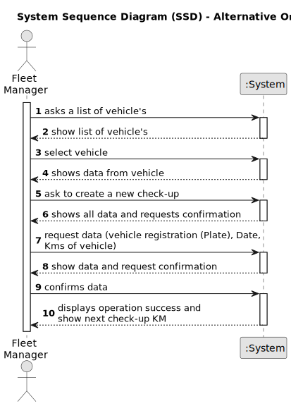
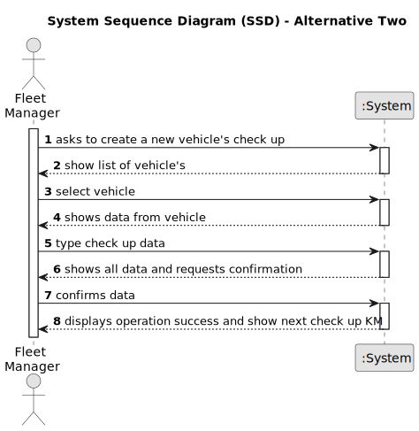

# US07 -  As an FM, I wish to register a vehicle’s check-up.

## 1. Requirements Engineering

### 1.1. User Story Description

As an FM, I wish to register a vehicle’s check-up with date, Kms of vehicle and Plate.

### 1.2. Customer Specifications and Clarifications 

**From the specifications document:**

>	"Fleet Manager (FM) – a person who manages the fleet park, the machines, equipment and vehicles, ensuring their good condition and assigning them to the tasks to be carried out."
>   FM ensuring vehicle's good condition by sending them for check-up.

**From the client clarifications:**

> **Question:** What do I need to record when checking the vehicle?
>
> **Answer:** Date, Kms of vehicle, Vehicle Registration.

### 1.3. Acceptance Criteria

* **AC1:** All required fields must be filled in. (client answered)
* **AC2:** (In)Success of the operation.

### 1.4. Found out Dependencies

* There is a dependency on "US06 - As an FM, I wish to register a vehicle including Brand, Model, Type, Tare, Gross Weight, Current Km, Register Date, Acquisition Date, Maintenance/Checkup Frequency (in Kms)" as there must be the frequency of maintenance and the kms of the last maintenance.

### 1.5 Input and Output Data

**Input Data:**

* Typed data:
    * Date
    * Kms of vehicle
	
* Selected data:
    * vehicle registration (Plate)

**Output Data:**

* (In)Success of the operation
* Next check-up Km.

### 1.6. System Sequence Diagram (SSD)

**_Other alternatives might exist._**

#### Alternative One

#### Alternative Two

### 1.7 Other Relevant Remarks

* The created task stays in a "not published" state in order to distinguish from "published" tasks.