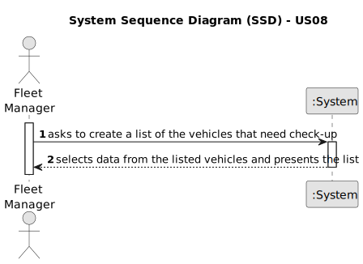

# US08 -  As an FM, I want to list the vehicles needing the check-up.

## 1. Requirements Engineering

### 1.1. User Story Description

As a Fleet Manager, I want to prompt the creation of a list, generated automatically, of the vehicles needing their check-up, based on the amount of kilometers each of the vehicles has, within a defined range of kilometers. The list should include all the information about the vehicle like plate, brand, model, etc.

### 1.2. Customer Specifications and Clarifications

**From the specifications document:**

>	"Fleet Manager (FM) – a person who manages the fleet park, the machines, equipment and vehicles, ensuring their good condition and assigning them to the tasks to be carried out."
>   Person who will list the vehicles who need the check-up.

>   "Vehicles are needed to carry out the tasks assigned to the teams as well as to transport machines and equipment."
>   Uses of the vehicles.

>   "This type of vehicle can only be for passengers or mixed, light or heavy, open box or closed vans or trucks."
>   Types of vehicles to list.

**From the client clarifications:**

> **Question:** What content do you want presented in the list?
>
> **Answer:** List the vehicles that need a check-up.

> **Question:** What are the factors that define if a vehicle needs a check-up?
>
> **Answer:** The vehicle needs to be in the range of 200 to 300 km.

> **Question:** What information will appear on the final list regarding the vehicle,besides the needing for check-up?
>
> **Answer:** Data that allow to identify the vehicle like Plate, brand and model, as well as, the data that allowed to select/insert the vehicle in the list, number of kms, frequency of checkup and the last checkup.

> **Question:** Can the vehicles get placed automatically on a list or the one listing has to be the FM?
>
> **Answer:** The list of vehicles is automatically created but the creation is triggered by the FM.

### 1.3. Acceptance Criteria

* **AC1:** A list with the vehicles that need a check-up needs to be created automatically.
* **AC2:** The list creation needs to be prompted by the FM.
* **AC3:** The list needs to be created with the information about the vehicles already gathered in the system.
* **AC4:** The vehicles in the list have to be within the range of 200-300km.
* **AC5:** The list needs to appear with data that allows to identify the vehicles.

### 1.4. Found out Dependencies

* There is a dependency on "US06 - As an FM, I wish to register a vehicle including Brand, Model, Type, Tare, Gross Weight, Current Km, Register Date, Acquisition Date, Maintenance/Checkup Frequency (in Kms)." as we need to know which vehicles are registered and their information to know which vehicles we need to list for the check-up.
* There is a dependency on "US07 - As an FM, I wish to register a vehicle’s check-up." as we need to list the vehicles that have a check-up registered from the overall vehicles.

### 1.5 Input and Output Data

**Input Data:**

No input data needed.

**Output Data:**

* List of the vehicles needing a check-up.

### 1.6. System Sequence Diagram (SSD)

**_Other alternatives might exist._**

#### Alternative One

### 1.7 Other Relevant Remarks

* The created task stays in a "not published" state in order to distinguish from "published".