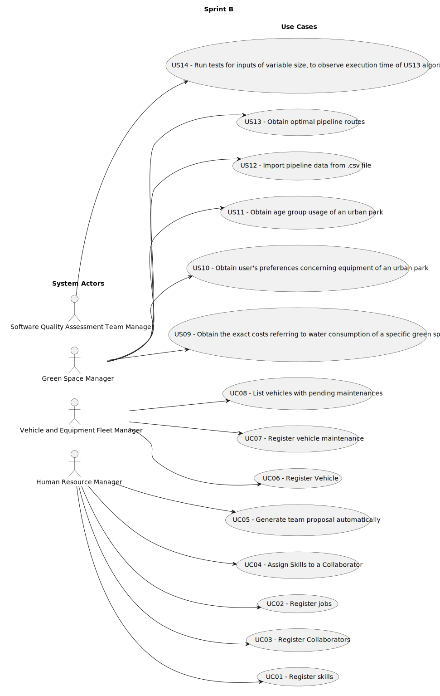

# Use Case Diagram (UCD)

**In the scope of this project, there is a direct relationship of _1 to 1_ between Use Cases (UC) and User Stories (US).**

However, be aware, this is a pedagogical simplification. On further projects and course units there may also exist _1 to N **and/or** N to 1_ relationships between UC and US.

**Insert below the Use Case Diagram in a SVG format**

**For each UC/US, it must be provided evidences of applying main activities of the software development process (requirements, analysis, design, tests and code). Gather those evidences on a separate file for each UC/US and set up a link as suggested below.**

# Use Cases / User Stories

| UC/US | Description                                                                                   |                   
|:------|:----------------------------------------------------------------------------------------------|
| US01  | [Register Skills](../../us01/Readme.md)                                                       |
| US02  | [Register Jobs](../../us02/Readme.md)                                                         |
| US03  | [Register Collaborators](../../us03/Readme.md)                                                |
| US04  | [Assign skills to a Collaborator](../../us04/Readme.md)                                       |
| US05  | [Generate team proposal automatically](../../us05/Readme.md)                                  |
| US06  | [Register Vehicle](../../us06/Readme.md)                                                      |
| US07  | [Register vehicle maintenance](../../us07/Readme.md)                                          |
| US08  | [List vehicles with pending maintenances](../../us08/Readme.md)                               |
| US09  | [Obtain the exact costs referring to water consumption of a specific green space]()                                                          |
| US10  | [Obtain user's preferences concerning equipment of an urban park]()                           |
| US11  | [Obtain age group usage of a urban park]()                                                    |
| US12  | [Import pipeline data from .csv file]()                                                       |
| US13  | [Obtain optimal pipeline routes]()                                                            |
| US14  | [US14 - Run tests for inputs of variable size, to observe execution time of US13 algorithm]() |