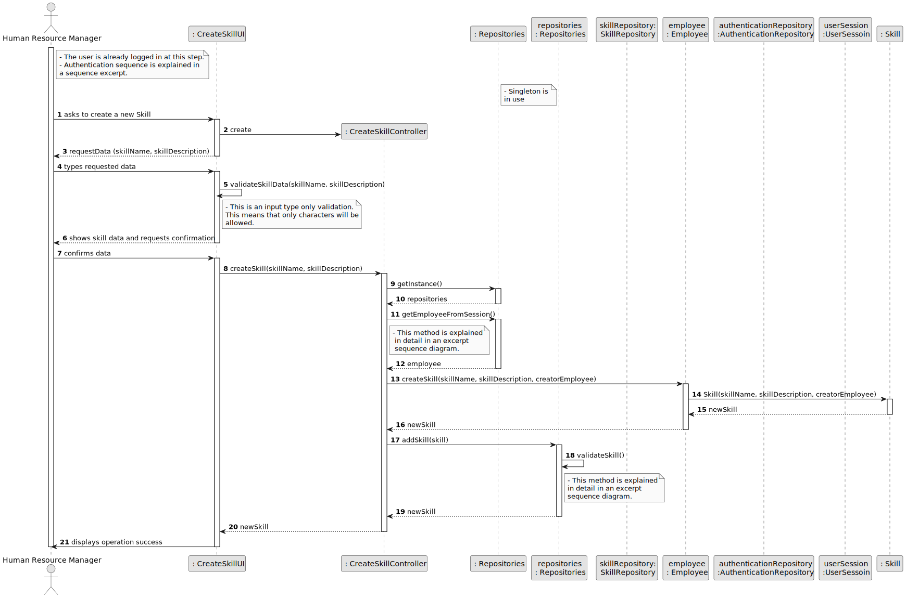

# US01 - As a Human Resources Manager (HRM), I want to register skills that may be appointed to a collaborator.

## 3. Design - User Story Realization 

### 3.1. Rationale

| Interaction ID | Question: Which class is responsible for...                                      | Answer                | Justification (with patterns)                                                                                                                                                                       |
|:---------------|:---------------------------------------------------------------------------------|:----------------------|:----------------------------------------------------------------------------------------------------------------------------------------------------------------------------------------------------|
| Step 1         | ... interacting with the actor                                                   | CreateSkillUI         | There is no reason to assign this responsibility to any existing class in the Domain Model (Pure Fabrication)                                                                                       |
|                | ... instantiating the class tha handles the UI?                                  | CreateSkillUI         | There is no reason to assign this responsibility to any existing class in the Domain Model (Pure Fabrication)                                                                                       |
|                | ... coordinating the US?                                                         | CreateSkillController | Ensures decouple between the UI layer and the Domain layer. (Controller, Low coupling, High Cohesion)                                                                                               |
| Step 2         | ... instantiating the controller                                                 | CreateSkillUI         | There is no reason to assign this responsibility to any existing class in the Domain Model (Pure Fabrication)                                                                                       | 
| Step 3         | ... display the form for the actor to input data?                                | CreateSkillUI         | Interaction with the user, there is no reason for other class to have this responsibility (Pure Fabrication)                                                                                        |
| Step 4         | ... temporarily keeping the input data?                                          | CreateSkillUI         | Before passing the data to the CreateSkillController for further coordination (Pure Fabrication)                                                                                                    |
| Step 5         | ... validating the inputted data?                                                | CreateSkillUI         | Validating only data types, business rules are validated in the domain layer (Pure Fabrication)                                                                                                     |
| Step 6 and 7   | ... showing all data and requesting confirmation?                                | CreateSkillUI         | Interaction with the user (Pure Fabrication)                                                                                                                                                        |
| Step 8         | ... coordinating the creation the skill object?                                  | CreateSkillController | Ensures decouple between the UI layer and the Domain layer. Answers the UI requests. (Controller, Low coupling, High Cohesion)                                                                      |
| Step 9         | ... keeping the                                                                  | SkillRepository       | Pure Fabrication / Creator (there is no reason for other class to have this responsibility / aggregates instances of Skills, and Skills are not specific to the Organization nor the Collaborators) |
| Step 13 and 16 | ... creating the skill object?                                                   | Employee              | In the domain model is the responsible for creating Skills as a Manager (Creator)                                                                                                                   |
| Step 14 and 15 | ... knowing the required data to create a new instance of Skill?                 | Skill                 | Knows its own data (Information Expert)                                                                                                                                                             |
|                | ... validating (mandatory) data locally??                                        | Skill                 | Should be responsible for validating its own data (Information Expert)                                                                                                                              |
| Step 17        | ... adding the skill to a collection and globally validating duplicated records? | SkillRepository       | Information Expert (knows all the Skill instances)                                                                                                                                                  |
| Step 6         | ... informing the operation success?                                             | CreateSkillUI         | Pure Fabrication                                                                                                                                                                                    |              

### Systematization ##

According to the taken rationale, the conceptual classes promoted to software classes are: 

* Organization
* Task

Other software classes (i.e. Pure Fabrication) identified: 

* CreateTaskUI  
* CreateTaskController

## 3.2. Sequence Diagram (SD)

_**Note that SSD - Alternative Two is adopted.**_

### Full Diagram

This diagram shows the full sequence of interactions between the classes involved in the realization of this user story.

### Split Diagrams

The following diagram shows the same sequence of interactions between the classes involved in the realization of this user story, but it is split in partial diagrams to better illustrate the interactions between the classes.

It uses Interaction Occurrence (a.k.a. Interaction Use).

**Get Task Category List Partial SD**

**Get Task Category Object**

**Get Employee**

**Create Task**

## 3.3. Class Diagram (CD)

