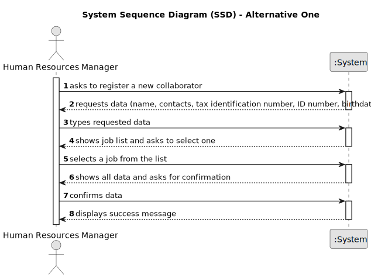

## 1. Requirements Engineering

### 1.1. User Story Description

As an HRM, I want to register a collaborator with a job, such as designer, estimator, gardener, electrician or bricklayer and fundamental
characteristics like name, tax identification number, birthdate, ID number, contacts and address.
### 1.2. Customer Specifications and Clarifications 

**From the specifications document:**

>	"Some job examples are designer, estimator, gardener, electrician
or bricklayer."
 
>	In this part of the specifications we can find the jobs specified by the client.

> "US02 - As an HRM, I want to register a job."

> Before registering a collaborator with a job the job must be registered by the HRM.

> "Human Resources Manager (HRM) - a person who manages human resources
and defines teams based on the needs of ongoing projects and the skills of the
employees."

> The HRM is the actor responsible to register the collaborator with a job and fundamental characteristics. 

**From the client clarifications:**

> **Question:** Which characteristics are considered "fundamental characteristics"?
>
> **Answer:** Name, profession, ID number, Social Security number, NIF, tax identification number, birthdate, Job start date, emergency contact, e-mail, phone nr and address.

> **Question:** Which data is necessary to register the collaborator?
>
> **Answer:** Name, birthdate, ID number, contact, profession and tax identification number.

### 1.3. Acceptance Criteria

* **AC1:** Name, birthdate, admission date, address, contact info (mobile and email), ID doc type and respective number should be provided by HRM.
* **AC2:** A job must be chosen from the list of jobs available.
* **AC3:** The Birthdate must be validated to assure that the collaborator is over eighteen years old.
* **AC4:** A new collaborator must be created.

### 1.4. Found out Dependencies

* There is a dependency on "US02 - As an HRM, I want to register a job." as there must be at least one job for the HRM to choose, when he registers a collaborator.

### 1.5 Input and Output Data

**Input Data:**

* Typed data:
    * Name
    * Birthdate 
    * ID Number
    * Contact
    * Tax Identification Number
    * Profession
  

* Selected data:
  * job

**Output Data:**

* Collaborator data with job and fundamental characteristics
* Success or failure message and feedback in case of failure 

### 1.6. System Sequence Diagram (SSD)

