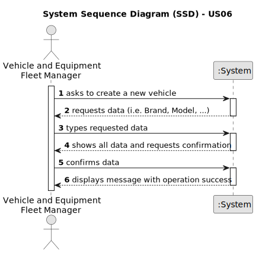

# US06 -  As a VFM, I wish to register a vehicle including Brand, Model, Type, Tare Weight, Gross Weight, Current Km, Register Date, Acquisition Date, and Maintenance/Check-up Frequency (in km).

## 1. Requirements Engineering

### 1.1. User Story Description

As an VFM, I wish to register a new vehicle in the system. The registered vehicle needs to have Brand, Model, Type, Tare Weight, Gross Weight, Current Km, Register Date, Acquisition Date, Maintenance/Checkup Frequency (in Kms), Plate Number, Number of Passengers, Number of Doors, Fuel Type, Trailer Machines (Yes/No).

### 1.2. Customer Specifications and Clarifications 

**From the specifications document:**

>	"This type of vehicle can be only for passengers or mixed, light or heavy, open box or closed vans or trucks."
>   Type of vehicle's to register.

>   "Vehicle and Equipment Fleet Manager (VFM) – a person who manages the fleet park, the machines, equipment and vehicles, ensuring their good condition and assigning them to the tasks to be carried out."
>   Person who will register vehicle.

**From the client clarifications:**

> **Question:** What extra data will I need to record??
>
> **Answer:** Plate Number, number of passengers, number of doors, type of fuel, is it possible to trailer machines.

> **Question:** Who updates vehicle kilometers and how often?
>
> **Answer:** VFM updates kilometers weekly.

### 1.3. Acceptance Criteria

* **AC1:** All required fields (fields defined in topic 1.5) must be filled in. 
* **AC2:** A new vehicle will be registered.
* **AC3:** When the vehicle is added to the system, a message should be displayed.

### 1.4. Found out Dependencies

* There is no dependency.

### 1.5 Input and Output Data

**Input Data:**

* Typed data [required fields]:
    * Brand
    * Model
    * Type
    * Tare Weight
    * Gross Weight
    * Current Km
    * Register Date
    * Acquisition Date
    * Maintenance/Check-up Frequency (in Km)
    * Plate Number
    * Passengers Number
    * Doors Number
    * Fuel Type
    * Trailer Machines (Yes/No)

**Output Data:**

* Message should be displayed with (in)success of the operation.

### 1.6. System Sequence Diagram (SSD)

### 1.7 Other Relevant Remarks

* VFM updates kilometers weekly.