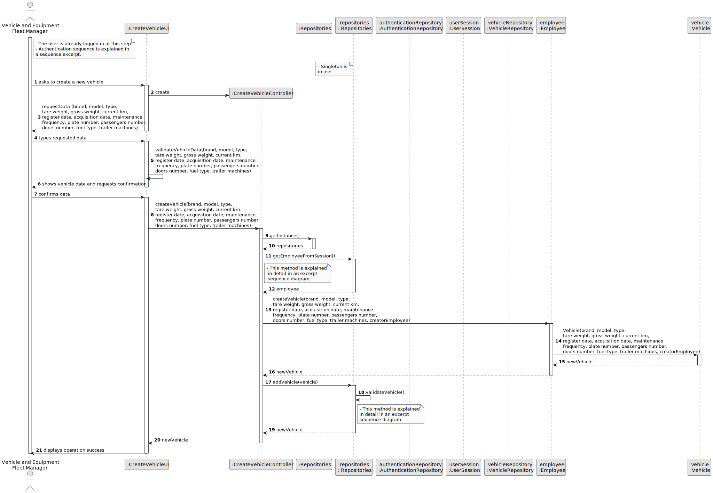

# US06 -  As a VFM, I wish to register a vehicle including Brand, Model, Type, Tare Weight, Gross Weight, Current Km, Register Date, Acquisition Date, and Maintenance/Check-up Frequency (in km). 

## 3. Design - User Story Realization 

### 3.1. Rationale

| Interaction ID | Question: Which class is responsible for...                                 | Answer                  | Justification (with patterns)                                                                                      |
|:---------------|:----------------------------------------------------------------------------|:------------------------|:-------------------------------------------------------------------------------------------------------------------|
| Step 1         | ... instantiating the class tha handles the UI?                             | CreateVehicleUI         | Pure Fabrication                                                                                                   |
|                | ... obtaining the vehicle list?                                             | VehicleRepository       | Information Expert                                                                                                 |
|                | ... coordinating the US?                                                    | CreateVehicleController | Controller                                                                                                         |
|                | ... knowing the user using the system?                                      | UserSession             | IE: cf. A&A component documentation.                                                                               |
|                |                                                                             | Organization            | IE: knows/has its own Employees                                                                                    |
|                |                                                                             | Employee                | IE: knows its own data (e.g. email)                                                                                |
| Step 2         | ... display the form for the actor to input data?                           | CreateVehicleUI         | Pure Fabrication (interaction with the user, there is no reason for other class to have this responsibility)       |
| Step 3         | ... validating the inputted data?                                           | CreateVehicleUI         | Pure Fabrication (validating only data types, business rules are validated in a more internal layer of the system) |
|                | ... temporarily keeping the input data?                                     | CreateVehicleUI         | Pure Fabrication (before passing the data to the CreateVehicleController for further coordination)                 |
| Step 4         | ... displaying all the information before submitting?                       | CreateVehicleUI         | Pure Fabrication (interaction with the user)                                                                       |
| Step 5         | ... creating the vehicle object?                                            | Organization            | Creator ()                                                                                                         |
|                | ... validating data locally (mandatory data)??                              | Vehicle                 | Information Expert (should be responsible for validating its own data)                                             |
|                | ... adding to a collection and globally validating duplicated records?      | Organization            | Information Expert (knows all the Vehicle instances)                                                               |
| Step 6         | ... informing the operation success?                                        | CreateVehicleUI         | Pure Fabrication                                                                                                   |              

### Systematization ##

According to the taken rationale, the conceptual classes promoted to software classes are: 

* Organization
* Vehicle

Other software classes (i.e. Pure Fabrication) identified: 

* CreateVehicleUI  
* CreateVehicleController

## 3.2. Sequence Diagram (SD)

_**Note that SSD - Alternative Two is adopted.**_

### Full Diagram

This diagram shows the full sequence of interactions between the classes involved in the realization of this user story.

### Split Diagrams

The following diagram shows the same sequence of interactions between the classes involved in the realization of this user story, but it is split in partial diagrams to better illustrate the interactions between the classes.

It uses Interaction Occurrence (a.k.a. Interaction Use).

**Get Task Category List Partial SD**

**Get Task Category Object**

**Get Employee**

**Create Task**

## 3.3. Class Diagram (CD)

