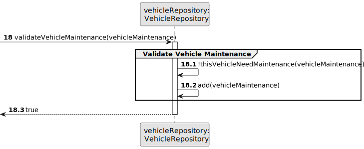
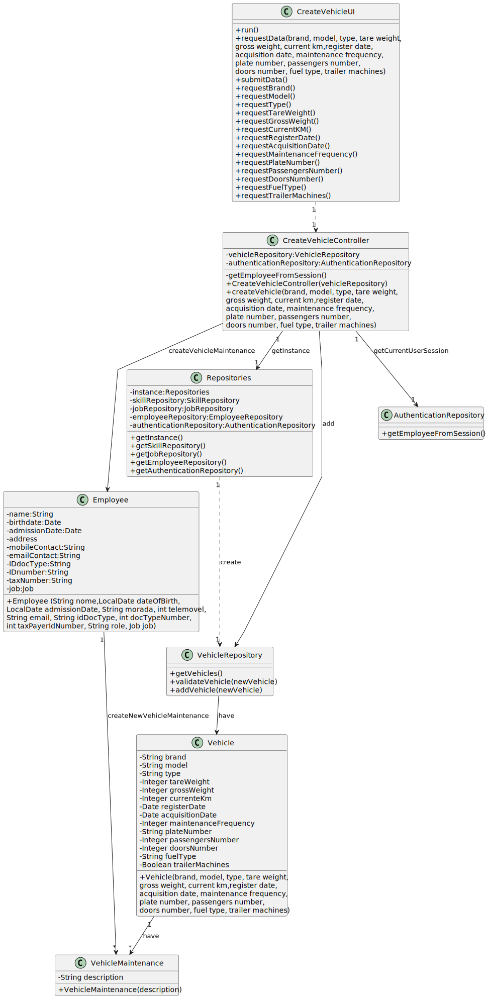

# US07 - As a VFM, I wish to register a vehicle’s maintenance.

## 3. Design - User Story Realization 

### 3.1. Rationale

| Interaction ID | Question: Which class is responsible for...                            | Answer                               | Justification (with patterns)                                                                                      |
|:---------------|:-----------------------------------------------------------------------|:-------------------------------------|:-------------------------------------------------------------------------------------------------------------------|
| Step 1         | ... instantiating the class that handles the UI?                       | RegisterVehicleMaintenanceUI         | Pure Fabrication                                                                                                   |
|                | ... coordinating the US?                                               | RegisterVehicleMaintenanceController | Controller                                                                                                         |
|                | ... knowing the user using the system?                                 | UserSession                          | IE: cf. A&A component documentation.                                                                               |
|                |                                                                        | Organization                         | IE: knows/has its own Employees                                                                                    |
|                |                                                                        | Employee                             | IE: knows its own data (e.g. email)                                                                                |
| Step 2         | ... obtaining the vehicle list?                                        | VehicleRepository                    | Information Expert                                                                                                 |
|                | ... display the form for the actor to select data?                     | RegisterVehicleMaintenanceUI         | Pure Fabrication (interaction with the user)                                                                       |
| Step 3         | ... saving the selected vehicle?                                       | RegisterVehicleMaintenanceUI         | Pure Fabrication (interaction with the user)                                                                       |
| Step 4         | ... display the form for the actor to input data?                      | RegisterVehicleMaintenanceUI         | Pure Fabrication (interaction with the user)                                                                       |
| Step 5         | ... validating the inputted data?                                      | RegisterVehicleMaintenanceUI         | Pure Fabrication (validating only data types, business rules are validated in a more internal layer of the system) |
|                | ... temporarily keeping the input data?                                | RegisterVehicleMaintenanceUI         | Pure Fabrication (before passing the data to the CreateVehicleController for further coordination)                 |
| Step 6         | ... displaying all the information before submitting?                  | RegisterVehicleMaintenanceUI         | Pure Fabrication (interaction with the user)                                                                       |
| Step 7         | ... creating the maintenance object?                                   | Employee                             | Creator ()                                                                                                         |
|                | ... validating data locally (mandatory data)??                         | Vehicle                              | Information Expert (should be responsible for validating its own data)                                             |
|                | ... adding to a collection and globally validating duplicated records? | Organization                         | Information Expert (knows all the Vehicle instances)                                                               |
| Step 8         | ... informing the operation success?                                   | RegisterVehicleMaintenanceUI         | Pure Fabrication                                                                                                   |              

### Systematization ##

According to the taken rationale, the conceptual classes promoted to software classes are: 

* Organization
* Employee
* Vehicle

Other software classes (i.e. Pure Fabrication) identified: 

* RegisterVehicleMaintenanceUI
* RegisterVehicleMaintenanceController

## 3.2. Sequence Diagram (SD)

### Full Diagram

This diagram shows the full sequence of interactions between the classes involved in the realization of this user story.

### Split Diagrams

The following diagram shows the same sequence of interactions between the classes involved in the realization of this user story, but it is split in partial diagrams to better illustrate the interactions between the classes.

It uses Interaction Occurrence (a.k.a. Interaction Use).

**Get Employee**

**Validate Vehicle Maintenance**

## 3.3. Class Diagram (CD)

