# User manual

- ### [Glossary](01.requirements-engineering/glossary.md)

- ### [Introduction](#intro)

- ### [System Overview](#sysov)

- ### [Features](#feat)

- ### [FAQs](#faq)

- ### [System Requirements](#sysreq)

- ### [Troubleshooting](#trouble)

#  Glossary

**Terms, Expressions and Acronyms (TEA) must be organized alphabetically.**

_(Complete according to the provided example)_

| **_TEA_** (EN)              | **_TEA_** (PT)                     | **_Description_** (EN)                                                                                                                                                                                                                                |                                       
|:----------------------------|:-----------------------------------|:------------------------------------------------------------------------------------------------------------------------------------------------------------------------------------------------------------------------------------------------------|
| **Absolute frequency**      | Frequência absoluta                | statistical term describing the number of times a particular piece of data or a particular value appears during a trial or set of trials.                                                                                                             |
| **Acceptance Criteria**     | Critérios de Aceitação             | Specific requirements that a user story must meet to be considered complete.                                                                                                                                                                          |
| **Adult**                   | Adulto                             | Person between 16 and 65 years old.                                                                                                                                                                                                                   |
| **Agenda**                  | Agenda                             | A schedule of planned tasks, including the team responsible, assigned vehicles/equipment, and current status.                                                                                                                                         |
| **Amenity**                 | Equipamento                        | Features and equipments that may equip green spaces.                                                                                                                                                                                                  |
| **Assembly Point**          | Ponto de Montagem                  | A predetermined location where people gather during an evacuation.                                                                                                                                                                                    |
| **Backhoes**                | Retroescavadoras                   | Excavating machine, equipped with an articulated arm at the rear with a shovel facing downwards.                                                                                                                                                      |
| **Barplot**                 | Gráfico de barras                  | Represents the category of data with rectangular bars with lengths and heights that is proportional to the values which they represent. The bar plots can be plotted horizontally or vertically.                                                      |
| **Blowers**                 | Sopradores                         | Device that propels air out of a nozzle to move debris such as leaves and grass cuttings.                                                                                                                                                             |
| **Boxplot**                 | Diagrama de extremos e quartis     | graph summarising a set of data. The shape of the boxplot shows how the data is distributed and it also shows any outliers.                                                                                                                           |
| **Brush Cutter**            | Ferramenta de Corte                | Powered garden or agricultural tool used to trim weeds, small trees, and other foliage not accessible by a lawn mower.                                                                                                                                |
| **Chainsaw**                | Motoserra                          | Mechanical power-driven cutting tool with teeth set on a chain which moves around the edge of a blade.                                                                                                                                                |
| **Child**                   | Criança                            | Person up to 15 years old.                                                                                                                                                                                                                            |
| **Closed Vans**             | Carrinhas Fechadas                 | Small closed truck, used to transport passengers and equipment.                                                                                                                                                                                       |
| **Coefficient of skewness** | Coeficiente de Assimetria          | Measure of asymmetry in the distribution.                                                                                                                                                                                                             |
| **Collaborator**            | Colaborador                        | A person employed of the organization and carries out design, construction and/or maintenance tasks for green areas, depending on their skills.                                                                                                       |
| **Configuration File**      | Arquivo de configuração            | A file that stores settings used by a program.                                                                                                                                                                                                        |
| **Daily Management**        | Gestão Diária                      | The ongoing tasks required to maintain the parks in good condition.                                                                                                                                                                                   |
| **Drinking fountain**       | Bebedouro                          | A fountain designed to provide drinking water.                                                                                                                                                                                                        |
| **Email Service**           | Serviço de Email                   | A platform used to send electronic messages.                                                                                                                                                                                                          |
| **Evacuation Route**        | Rota de Evacuação                  | The path users follow to reach an Assembly Point.                                                                                                                                                                                                     |
| **Garden**                  | Jardim                             | Garden space with or without trees with little or no equipment (may have a basic irrigation system).                                                                                                                                                  |
| **Green space**             | Espaço verde                       | Open-space areas reserved for parks. In the context of this application, green spaces may be categorized as Gardens, Medium-sized parks and Large-sized parks.                                                                                        |
| **GSM**                     | GEV                                | Acronym for _Green Spaces Manager_, the person responsible for managing the green spaces in charge of the organization.                                                                                                                               |
| **GSU**                     | UEV                                | Acronym for _Green Spaces User_, a person who uses the green spaces managed by the organization and who can through the Portal, make comments or report faults in parks and gardens on the Portal.                                                    |
| **Heavy Vehicle**           | Veículos Pesados                   | Vehicles with a gross weight of more than 3500 kg or with a capacity of more than nine seats, including the driver's seat.                                                                                                                            |
| **Histograms**              | Histogramas                        | Graphical representation of discrete or continuous data.                                                                                                                                                                                              |
| **HRM**                     | GRH                                | Acronym for _Human Resources Manager_, a person who manages human resources and defines teams based on the needs of ongoing projects and the skills of the employees.                                                                                 |
| **Irrigation system**       | Sistema de irrigação               | System for supplying land with water by means of artificial canals to promote the growth and subsistence of plant material.                                                                                                                           |
| **Jupyter notebook**        | Jupyter notebook                   | Jupyter Notebook is the original web application for creating and sharing computational documents. It offers a simple, streamlined, document-centric experience.                                                                                      |
| **KPI**                     | ICP                                | Indicators like: water or energy consumption, most used pieces of equipment, and park users’ profile by age, for instance                                                                                                                             |
| **Landscaped area**         | Área paisagística                  | Combination of trees, shrubs, flowers, grass or the horticultural elements, decorative stonework, pavers, screening or other landscape architectural elements.                                                                                        |
| **Large-sized park**        | Parque urbano de grandes dimensões | Multi-function space with diverse garden spaces, and woods, including varied equipment and services.                                                                                                                                                  |
| **LaTeX**                   | LaTeX                              | LaTeX is a markup language that handles typesetting and rendering, and can be arbitrarily extended by using the underlying macro language to develop custom macros such as new environments and commands.                                             |
| **Lawn Mower**              | Cortador de Relva                  | Machine used to cut exhisting grass and low vegetation.                                                                                                                                                                                               |
| **Lifting Platform**        | Plataforma elevatória              | Type of multi-functional machinery that is used for lifting and loading people or goods in a vertical form.                                                                                                                                           |
| **Light Vehicle**           | Veículos Ligeiros                  | Vehicles with a gross weight equal to or less than 3500 kg and with a capacity of no more than nine seats, including the driver's seat.                                                                                                               |
| **Lighting system**         | Sistema de iluminação              | Elements required to maintain a desired light level, including lamps, light fixtures, fixture distribution, sensors and control technologies.                                                                                                         |
| **Linear Regression**       | Regressão Linear                   | A statistical method used to model the relationship between a dependent variable (e.g., water cost) and an independent variable (e.g., park area).                                                                                                    |
| **Mean**                    | Média                              | The "average" number; found by adding all data points and dividing by the number of data points.                                                                                                                                                      |
| **Median**                  | Mediana                            | The middle number; found by ordering all data points and picking out the one in the middle (or if there are two middle numbers, taking the mean of those two numbers).                                                                                |
| **Medium-sized park**       | Parque urbano de médias dimensões  | Green space with a few hundred or thousands of square meters with a wooded garden area, it includes some infrastructures such as toilets, drinking fountains, irrigation system, lighting, children’s playground.                                     |
| **MS**                      | MS                                 | Acronym fom _Musgo Sublime_, the organization dedicated to planning, construction and maintenance of the green spaces.                                                                                                                                |
| **Musgo Sublime**           | Musgo Sublime                      | The client. MS is the organization dedicated to planning, construction and maintenance of the green spaces.                                                                                                                                           |
| **Municipal Master Plan**   | Plano diretor Municipal            | Also known as the Comprehensive Plan, provides a long-term vision for the community's development. It assists in guiding you on how to use lands appropriately within municipal orders. And helps protect public health, safety, and general welfare. |
| **Occupation**              | Ocupação                           | Collaborator's job.                                                                                                                                                                                                                                   |
| **Open box Vehicle**        | Veículos de caixa aberta           | Motor vehicle with an open rear, smaller than a truck.                                                                                                                                                                                                |
| **Outlier**                 | Outlier                            | Value in a data set that is very different from the other values. That is, outliers are values unusually far from the middle.values that deviate from the median by more than 1.5 times the interquartile range;                                      |
| **Park**                    | Parque                             | Area of natural, semi-natural or planted space set aside for human enjoyment and recreation or for the protection of wildlife or natural habitats.                                                                                                    |
| **Phytopharmaceutical**     | Fito-Farmaco                       | Products applied to protect cultures, like herbicides.                                                                                                                                                                                                |
| **Pie chart**               | Gráfico circular                   | A type of graph that represents the data in the circular graph. The slices of pie show the relative size of the data, and it is a type of pictorial representation of data.                                                                           |
| **Plant material**          | Material vegetal                   | Plants and their progeny, namely flowers, shrubs and trees.                                                                                                                                                                                           |
| **Playground**              | Parque infantil                    | Place designed to provide an environment for children that facilitates play.                                                                                                                                                                          |
| **Polynomial Regression**   | Regressão Polinomial               | A type of regression that uses polynomial functions to model the relationship between variables. It's more flexible than linear regression but can be more complex to interpret.                                                                      |
| **Pruning**                 | Poda                               | Act of pruning is a gardenning task, which consist in cutting or thinning trees or plants.                                                                                                                                                            |
| **Pseudocode**              | Pseudocódigo                       | An informal language used to describe the steps of an algorithm in a human-readable way.                                                                                                                                                              |
| **Python**                  | Python                             | Programming Language.                                                                                                                                                                                                                                 |
| **QAM**                     | GAQ                                | Acronym for _Quality assessment Manager_, a person who manage the Software Quality Assessment Team and its process.                                                                                                                                   |
| **Rural area**              | Área rural                         | In general, a rural area or a countryside is a geographic area that is located outside towns and cities.                                                                                                                                              |
| **Senior**                  | Sénior                             | Person over 65 years old.                                                                                                                                                                                                                             |
| **Shortest Path Algorithm** | Algoritmo de caminho mais curto    | An algorithm that finds the quickest route between two points in a network.                                                                                                                                                                           |
| **Skills**                  | Competências                       | A set of habillities that a person have that enable him to perform/take on certain tasks/responsibilities, for example, driving vehicles of different types.                                                                                          |
| **Sprayers**                | Pulverizadores                     | Device used to spray a liquid, commonly used for projection of water or weed killers.                                                                                                                                                                 |
| **Standard deviation**      | Desvio padrão                      | The average amount of variability in your dataset. It tells you, on average, how far each value lies from the mean.                                                                                                                                   |
| **Team**                    | Equipa                             | A group of collaborators assigned to complete a task.                                                                                                                                                                                                 |
| **Topographic Survey**      | Levantamento Topográfico           | A map depicting the physical features of an area, including land elevation and existing paths.                                                                                                                                                        |
| **To-Do List**              | Lista de afazeres                  | A list of tasks that need to be completed, categorized by urgency and estimated duration.                                                                                                                                                             |
| **Time Complexity**         | Complexidade de tempo              | A measure of how the execution time of an algorithm grows with the size of its input.                                                                                                                                                                 |
| **Tractor**                 | Trator                             | Heavy motor vehicle that has a powerful engine whose wheels adhere strongly to the ground and can be used, for example, to drag trailers.                                                                                                             |
| **Trucks**                  | Camiões                            | Large car with its own engine, with four or more wheels, intended for the transport of goods.                                                                                                                                                         |
| **Urban**                   | Urbano                             | Something related to a city.                                                                                                                                                                                                                          |
| **Urban area**              | Área urbana                        | Human settlement with a high population density and an infrastructure of built environment.                                                                                                                                                           |
| **Urban furniture**         | Mobiliário urbano                  | Items, objects, and equipment installed in urban parks such as benches, tables gymnastic equipment, etc..                                                                                                                                             |
| **Urban park**              | Parque urbano                      | Green space set aside for recreation inside towns and cities.                                                                                                                                                                                         |
| **US**                      | US                                 | Acronym for _User Story_, a description of a software feature from the user's perspective..                                                                                                                                                           |
| **User portal**             | Portal do utilizador               | Platform where parks and garden users can post comments, and report faults and malfunctions of equipment.                                                                                                                                             |
| **VFM**                     | GFEV                               | Acronym for _Vehicle and Equipment Fleet Manager_, a person who manages the fleet park, the machines, equipment and vehicles, ensuring their good condition and assigning them to the tasks to be carried out.                                        |
| **Wooded area**             | Área arborizada                    | Area covered by trees .                                                                                                                                                                                                                               |

##  Introduction
[top](#top)
> Green spaces are essential support for citizens' quality of life, as they promote biodiversity, recreation and leisure, in addition to sustaining and organizing the urban fabric.
> 
> They are promoters of ecological and cultural continuity, essential for environmental sustainability, which integrates resources as diverse as parks, gardens, partitioned hedges, trees in streets and in areas free from buildings that contribute to the construction of the “urban forest”.
>
>The management of water resources is also an important issue in the management of urban parks, which is why it is increasingly important to make appropriate use of this asset.
> 
>All of this is not possible without people, which is why adequate management of human resources, in order to value them, keep them motivated and efficient, is also of great importance.
> 
>Today, it is increasingly important to make correct use of the technology we have at our disposal. In the information age, companies need to use IT solutions to remain competitive, with an environmental and sustainable focus and to develop low-price, added-value products.
> 
>The application developed by our team, the context of which will be explained in the following pages, aims to facilitate the management of urban parks within the scope of personnel management, team management, equipment, vehicles and respective maintenance and tasks.

##  System Overview 
[top](#top)

>Our application, hereinafter referred to as the system, is a comprehensive management tool specifically designed to address the multifaceted needs of public park management entities. It is crafted to streamline operations, enhance decision-making, and optimize the management of human resources, equipment, vehicles, green spaces, and quality assessments.
>
>The system offers robust human resources management capabilities, maintaining a detailed database of employees, tracking individual attributes such as skills and qualifications, and assisting in the scheduling and allocation of tasks based on availability and competencies. This ensures that the right personnel are assigned to the right tasks, enhancing operational efficiency.
>
>In terms of equipment management, the system keeps an up-to-date inventory of all equipment, tracking their status, location, and condition. It schedules and monitors routine maintenance and repairs to ensure that all equipment remains in optimal working condition, and it monitors usage patterns to identify trends and optimize equipment utilization.
>
>The system also provides comprehensive vehicle fleet management. It maintains detailed records of all vehicles, including specifications, purchase details, and current status, and tracks maintenance schedules and histories to ensure timely servicing and repairs. By monitoring vehicle usage patterns, the system helps optimize fleet operations, reducing downtime and improving operational efficiency.
>
>A key feature of the system is its green spaces management module. This module maintains detailed records of all green spaces, including size, location, plant species, and maintenance needs. It creates tasks for green space maintenance, which initially appear in a to-do list with a pending status. These tasks are then moved to an agenda where they can be tracked through different statuses such as planned, doing, done, and postponed. This ensures that all maintenance activities are systematically planned and executed.
>
>Additionally, the system includes a quality assessment manager. This feature maintains a database of quality assessments for various areas and activities within the park, defining and tracking criteria such as cleanliness, safety, and visitor satisfaction. It generates reports on these assessments, helping to identify areas for improvement and track progress over time.
>
>As a decision support tool, the system can automatically generate teams based on parameters such as required skills and the number of team members needed. It provides recommendations for the optimal allocation of human and material resources and analyzes data to generate insights into workforce performance, equipment efficiency, and vehicle utilization. This ensures that resources are used effectively and that decisions are based on comprehensive, data-driven insights.
>
>The system is designed to be user-friendly, with an intuitive interface that makes it easy for managers to access and utilize the various features. It includes dashboards, reports, and visualizations that provide quick insights into operations and supports both desktop and mobile access to facilitate management on-the-go.
>
>By integrating comprehensive management capabilities with advanced decision support tools and additional features for quality assessment and green spaces management, the system significantly enhances the efficiency, effectiveness, and sustainability of public park management entities. It streamlines management tasks, saves time, reduces administrative overhead, and ensures that high standards are met and maintained, ultimately leading to better-managed parks and more satisfied visitors.

##  Features
[top](#top)

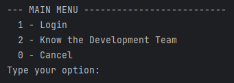

In the Main Menu is where the user can login to get access to the rest of the features.

## I. Human Resources Manager Features
[top](#top)

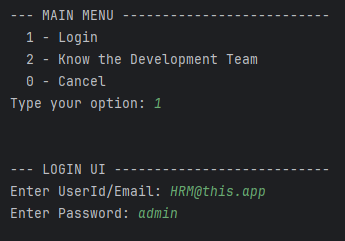

Each user must be logged in to have access to each role's options.

### 1. Register Skills

**Access:**

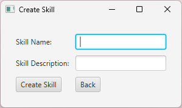

Choose option number 1 (1 - Create Skill) from the HRM MENU.

**Registration Process:**

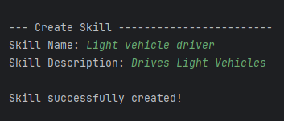

Enter the skill name (e.g., Project Management, Software Development).

Provide a detailed description of the skill.

If followed correctly skill will be successfully created!

### 2. List Skills

**Access:**

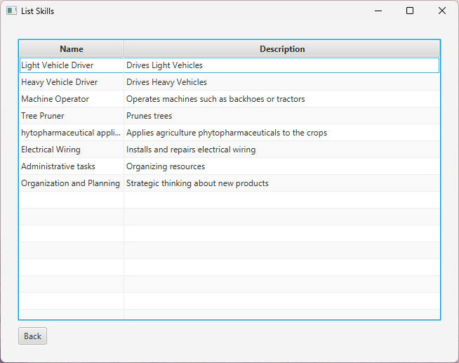

Choose option number 2 (2 - List Skills) from the HRM MENU.

**Viewing List:**

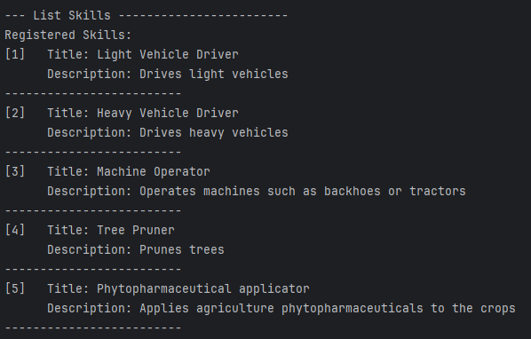

A list with all skills available and their descriptions will be presented.

### 3. Register Jobs

**Access:**

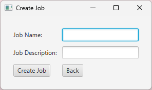

Choose option number 3 (3 - Create Job) from the HRM MENU.

**Registration Process:**

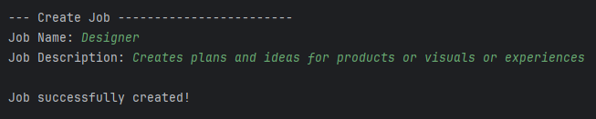

Enter the job title (e.g., Marketing Manager, Software Engineer).

Provide a detailed description of the job.

If followed correctly job will be successfully created!

### 4. List Job

**Access:**

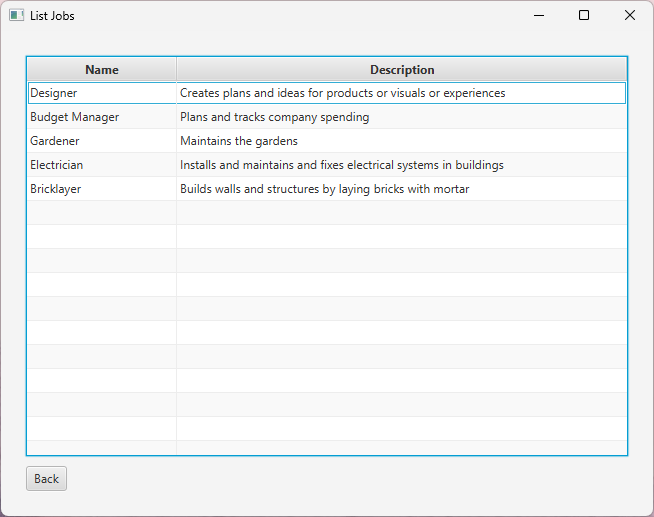

Choose option number 4 (4 - List Job) from the HRM MENU.

**Viewing List:**

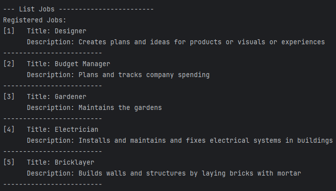

A list with all jobs available and their descriptions will be presented.

### 5. Register Collaborators (Employees)

**Access:**

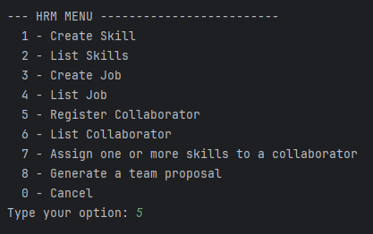

Choose option number 5 (5 - Create Job) from the HRM MENU.

**Registration Process:**

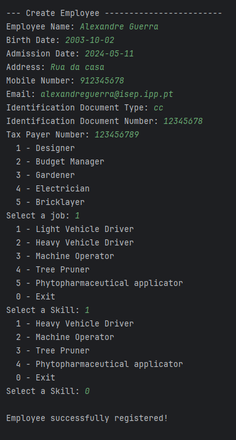

Enter the employee's details (name, contact information, etc.).

Select the job to be attributed from the list.

Select the skills to be attributed from the list.

If followed correctly collaborator will be successfully registered!

### 6. List Collaborator

**Access:**

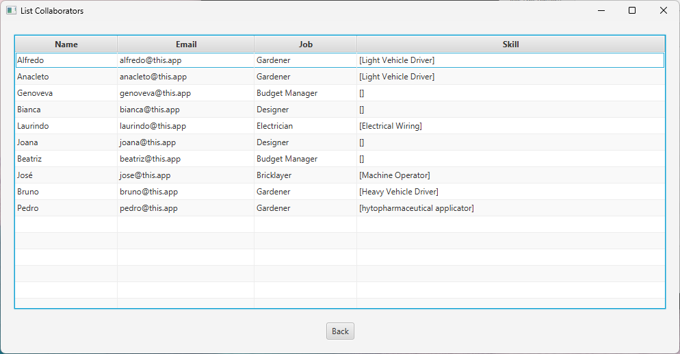

Choose option number 6 (6 - List Collaborator) from the HRM MENU.

**Viewing List:**

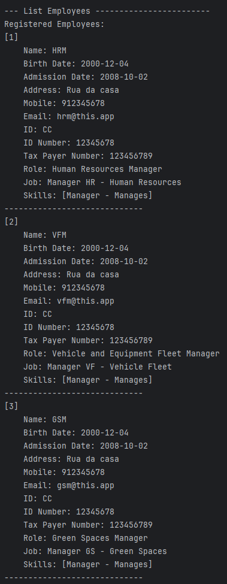

A list with all collaborators available and their information will be presented.

### 7. Assign Skills to a Collaborator

**Access:**

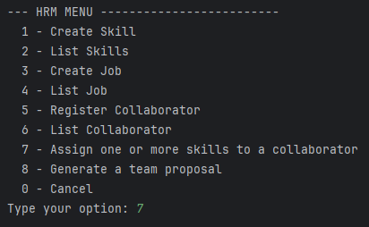

Choose option number 7 (7 - Assign one or more skills to a collaborator) from the HRM MENU.

**Assigning Skills:**

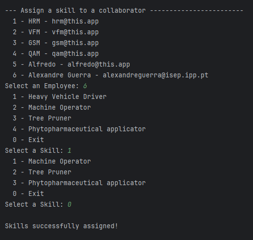

Choose the desired collaborator.

Select the skills to be attributed from the list.

If followed correctly collaborator will get the desired skills on his profile!

### 8. Generate Team Proposal Automatically

**Access:**

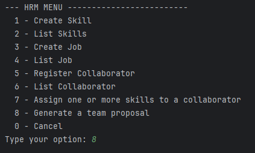

Choose option number 8 (8 - Generate a team proposal) from the HRM MENU.

**Generating Proposal:**

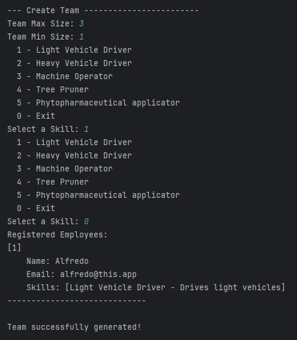

Enter the team details (Team Maximum Size, Team Minimum Size).

Choose desired skills that the employees of the team need to have.

If followed correctly and there were available employess with the desired skills the team will be successfully generated and the employees on the team will be displyed along with their information.

## II. Vehicle and Equipment Fleet Manager Features
[top](#top)

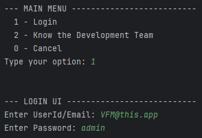

Each user must be logged in to have access to each role's options.

### 1. Register Vehicle

**Access:**

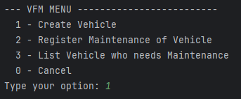

Choose option number 1 (1 - Create Vehicle) from the VFM MENU.

**Registration Process:**

Not developed.

### 2. Register Vehicle Maintenance

**Access:**

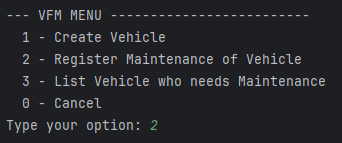

Choose option number 2 (2 - Register Maintenance of Vehicle) from the VFM MENU.

**Registration Process:**

Not developed.

### 3. List Vehicles with Pending Maintenance

**Access:**

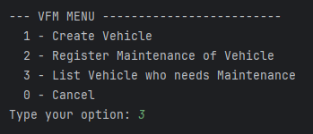

Choose option number 3 (3 - List Vehicle who needs Maintenance) from the VFM MENU.

**Viewing List:**

Not developed.

##  Frequently Asked Questions (FAQ)
[top](#top)

### General Questions

**Q1: What is the primary purpose of this system?**

**A1:** The primary purpose of the system is to streamline and enhance the management of public park operations by providing comprehensive tools for managing human resources, equipment, vehicles, green spaces, and quality assessments. It aims to facilitate decision-making and optimize resource utilization.

**Q2: Who is the intended user of this system?**

**A2:** The system is designed for public park management entities, including park administrators, human resource managers, maintenance supervisors, and other personnel involved in the operational management of public parks.

### Human Resources Management

**Q3: What kind of information can be stored in the human resources database?**

**A3:** The human resources database can store detailed records of employees, including personal information, skills, qualifications, work history, performance metrics, and availability.

**Q4: Can the system help with employee scheduling?**

**A4:** Yes, the system assists in scheduling shifts and allocating tasks based on employee availability and competencies, ensuring that the right personnel are assigned to the right tasks.

### Equipment and Vehicle Management

**Q5: How does the system track equipment and vehicles?**

**A5:** The system maintains detailed records of all equipment and vehicles, including their status, location, condition, specifications, and purchase details. It also tracks maintenance schedules and histories to ensure timely servicing and repairs.

**Q6: Can the system monitor equipment and vehicle usage?**

**A6:** Yes, the system monitors usage patterns of both equipment and vehicles, helping to identify trends and optimize utilization to improve operational efficiency and reduce downtime.

### Green Spaces Management

**Q7: What features does the system offer for managing green spaces?**

**A7:** The system maintains detailed records of green spaces, including size, location, plant species, and maintenance needs. It creates tasks for green space maintenance, which are initially placed in a to-do list with a pending status. These tasks are then moved to an agenda where they can be tracked through different statuses: planned, doing, done, and postponed.

**Q8: How does the system help with green space maintenance?**

**A8:** By creating and tracking maintenance tasks through various stages, the system ensures that all activities are systematically planned and executed, keeping green spaces well-maintained and visually appealing.

### Quality Assessment Manager

**Q9: What is the purpose of the quality assessment manager?**

**A9:** The quality assessment manager maintains a database of quality assessments for different areas and activities within the park. It defines and tracks criteria such as cleanliness, safety, and visitor satisfaction, generating reports to identify areas for improvement and track progress.

**Q10: How can the quality assessment manager improve park operations?**

**A10:** By providing structured quality assessments and detailed reports, the quality assessment manager helps park managers identify areas that need attention, ensuring high standards are met and maintained.

### Decision Support Tools

**Q11: How does the system assist in decision-making?**

**A11:** The system offers decision support tools that can automatically generate teams based on specified parameters, recommend optimal resource allocation, and analyze data to generate insights into workforce performance, equipment efficiency, and vehicle utilization. This supports informed and effective decision-making.

**Q12: Can the system generate reports?**

**A12:** Yes, the system can generate various reports, including performance analytics, maintenance schedules, quality assessment summaries, and resource utilization statistics. These reports provide valuable insights for managers to make data-driven decisions.

### User Interface and Accessibility

**Q13: Is the system user-friendly?**

**A13:** Yes, the system is designed with an intuitive interface that makes it easy for managers to access and utilize its features. It includes dashboards, reports, and visualizations that provide quick insights into operations.

**Q14: Can the system be accessed remotely?**

**A14:** Yes, the system supports both desktop and mobile access, allowing managers to oversee operations and make decisions on-the-go.

**Q15: How can I get support if I encounter an issue with the system?**

**A15:** Support is available through our customer service team. You can contact us via email, phone, or through the support section of our website for assistance with any issues you encounter.

## System Requirements
[top](#top)

### Hardware Requirements

**For Servers:**
- **Processor**: Quad-core Intel or AMD processor, 2.5 GHz or faster
- **RAM**: Minimum 16 GB
- **Storage**: SSD with at least 500 GB of available space
- **Network**: Gigabit Ethernet connection
- **Backup**: External storage or cloud backup solution with sufficient capacity for daily backups

**For Client Computers:**
- **Processor**: Dual-core Intel or AMD processor, 2.0 GHz or faster
- **RAM**: Minimum 8 GB
- **Storage**: 250 GB HDD or SSD
- **Display**: 1920 x 1080 resolution or higher
- **Network**: Reliable internet connection (wired or wireless)

**For Mobile Devices:**
- **Operating System**: iOS 12.0 or later, Android 8.0 or later
- **Storage**: Minimum 50 MB of free space
- **Network**: Reliable internet connection (Wi-Fi or cellular)

### Software Requirements

**Server-Side:**
- **Operating System**: Windows Server 2016 or later, Ubuntu 18.04 or later, or equivalent Linux distribution
- **Database**: PostgreSQL 11 or later, MySQL 5.7 or later, or equivalent
- **Web Server**: Apache 2.4 or later, Nginx 1.14 or later
- **Application Server**: Node.js 12 or later, or an equivalent server-side runtime
- **Other Software**: Docker 19.03 or later for containerization (if applicable), Git for version control

**Client-Side (Web Application):**
- **Browser**: Latest versions of Google Chrome, Mozilla Firefox, Microsoft Edge, Safari
- **Operating System**: Windows 10 or later, macOS 10.13 or later, Linux distributions

**Client-Side (Desktop Application, if applicable):**
- **Operating System**: Windows 10 or later, macOS 10.13 or later
- **Dependencies**: Specific runtime environments (e.g., .NET Framework for Windows, or Electron for cross-platform applications)

### Network Requirements

- **Internet Bandwidth**: Minimum 10 Mbps download and upload speeds for both server and client machines to ensure smooth operation and data transfer.
- **Firewall**: Properly configured to allow necessary traffic for web server, database, and other service ports.

### Security Requirements

- **SSL/TLS Certificates**: For secure communication between clients and servers
- **Anti-Virus and Anti-Malware**: Installed and regularly updated on all client and server machines
- **User Authentication**: Multi-factor authentication (MFA) support for added security
- **Data Encryption**: At rest and in transit

### Backup and Recovery

- **Automated Backups**: Daily backups of all critical data
- **Recovery Plan**: Established procedures for data recovery in case of hardware failure or other issues

### Additional Requirements

- **Scalability**: Capability to scale server resources as user load increases
- **High Availability**: Optional load balancers and failover mechanisms for critical components
- **Maintenance**: Regular maintenance schedules and updates for software and hardware components

These requirements ensure that the system operates efficiently, securely, and reliably, providing a seamless experience for all users involved in public park management.

## Troubleshooting Guide
[top](#top)

#### Below are troubleshooting steps for each user story (US), focusing on common issues that might arise and how to resolve them.

### US01 - Register Skills for a Collaborator
**Issue:** Skill name contains special characters or digits.
**Solution:** Ensure that the skill name only includes alphabetic characters. Remove any special characters or digits before saving. Implement a validation rule to check for these characters before submission.

### US02 - Register a Job for a Collaborator
**Issue:** Job name contains special characters or digits.
**Solution:** Similar to skills, ensure that the job name contains only alphabetic characters. Add a validation step that restricts the input to letters only and alerts the user if the job name contains invalid characters.

### US03 - Register a Collaborator
**Issue:** Invalid taxpayer identification number or citizen card number.
**Solution:** Verify the format and length of the taxpayer identification number and citizen card number. Ensure they meet the national standards for validity. Implement real-time validation and provide immediate feedback if the entered details are incorrect.

### US04 - Assign Skills to a Collaborator
**Issue:** Unable to assign skills to a collaborator.
**Solution:** Ensure that the collaborator and the skill both exist in the database. Check for database connectivity issues. Validate that the skill assignment logic correctly associates the selected skills with the chosen collaborator.

### US05 - Generate a Team Proposal Automatically
**Issue:** Incorrect team size or skill set.
**Solution:** Confirm that the HRM inputs valid numbers for the minimum and maximum team size and that the skill set provided matches the existing skills in the database. Ensure the team generation algorithm respects these constraints and properly handles edge cases.

### US06 - Register a Vehicle
**Issue:** Missing or incorrect vehicle information.
**Solution:** Ensure all required fields (Brand, Model, Type, etc.) are filled with valid data. Implement validation checks for fields like dates and numerical values. Provide clear error messages if any field contains invalid data.

### US07 - Register a Vehicle’s Maintenance
**Issue:** Maintenance entry fails to save.
**Solution:** Verify that the vehicle ID exists and is correctly referenced in the maintenance record. Ensure that all required maintenance details are provided and correctly formatted. Check for database write permissions.

### US08 - Produce a List of Vehicles Needing Maintenance
**Issue:** Report fails to generate or displays incorrect data.
**Solution:** Ensure the data retrieval query accurately selects vehicles due for maintenance based on their current kilometers and maintenance frequency. Verify the report formatting logic to display the vehicle details correctly.

### US20 - Register a Green Space
**Issue:** Green space details not saved correctly.
**Solution:** Confirm that all required fields are filled in and correctly formatted. Check for database connectivity and write permissions. Ensure the area measurement is accurate and within acceptable ranges.

### US21 - Add a New Entry to the To-Do List
**Issue:** Unable to associate the entry with a green space.
**Solution:** Ensure that the green space selected by the GSM exists in the database. Validate that the entry form correctly links the new entry to the chosen green space. Check for errors in the dropdown list population logic.

### US22 - Add a New Entry in the Agenda
**Issue:** To-Do list entry not found.
**Solution:** Ensure that the entry exists in the To-Do list before attempting to add it to the agenda. Validate that the agenda entry form correctly references the existing To-Do list entry.

### US23 - Assign a Team to an Entry in the Agenda
**Issue:** Notification message not sent.
**Solution:** Verify the configuration file for email service settings. Ensure that the selected email service is properly configured and that the system has the necessary credentials. Check network connectivity and SMTP server status.

### US24 - Postpone an Entry in the Agenda
**Issue:** Unable to select a future date.
**Solution:** Ensure the date picker allows future dates only. Validate the selected date and confirm that it is properly stored in the database. Provide feedback if an invalid date is chosen.

### US25 - Cancel an Entry in the Agenda
**Issue:** Canceled task mistakenly deleted.
**Solution:** Modify the task state to 'canceled' without deleting it from the database. Ensure the application logic correctly updates the task state and retains the task record for future reference.

### US26 - Assign Vehicles to an Entry in the Agenda
**Issue:** Vehicles not correctly assigned.
**Solution:** Verify that the vehicle selection mechanism correctly references existing vehicles. Ensure the assignment logic accurately updates the agenda entry with the selected vehicles and that all database references are valid.

### US27 - List All Green Spaces Managed by GSM
**Issue:** Green spaces not sorted correctly.
**Solution:** Check the configuration file to ensure the correct sorting algorithm is specified. Validate that the list population logic applies the chosen sorting algorithm to display green spaces in descending order by size.

### US28 - Consult Tasks Assigned to Collaborator
**Issue:** Task list not filtered correctly.
**Solution:** Ensure the date range and task status filters are correctly applied. Validate that the query retrieves tasks within the specified dates and applies the selected status filter.

### US29 - Record Completion of a Task
**Issue:** Task completion status not updated.
**Solution:** Confirm that the task update logic correctly changes the status to 'completed' and that the database is updated accordingly. Ensure proper feedback is provided to the collaborator upon successful status change.

By following these troubleshooting steps, common issues for each user story can be identified and resolved efficiently, ensuring smooth operation and user satisfaction.