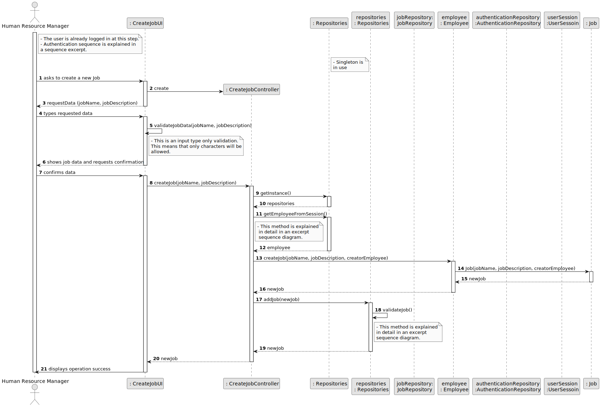
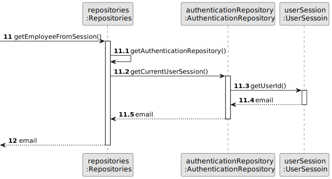
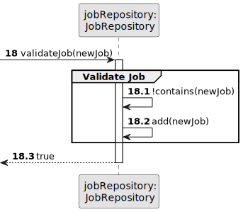
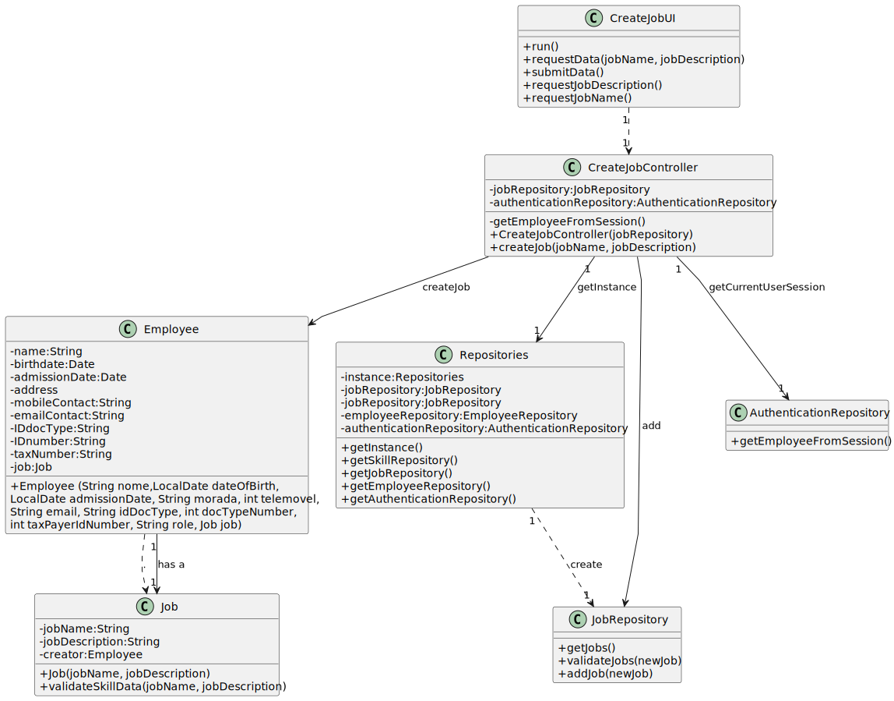

# US02 - As an HRM, I want to register a job..

## 3. Design - User Story Realization

### 3.1. Rationale

| Interaction ID | Question: Which class is responsible for...                    | Answer              | Justification (with patterns)                                                                                                                  |
|:---------------|:---------------------------------------------------------------|:--------------------|:-----------------------------------------------------------------------------------------------------------------------------------------------|
| Step 1         | ... interacting with the actor                                 | CreateJobUI         | There is no reason to assign this responsibility to any existing class in the Domain Model (Pure Fabrication)                                  |
|                | ... instantiating the class tha handles the UI?                | CreateJobUI         | There is no reason to assign this responsibility to any existing class in the Domain Model (Pure Fabrication)                                  |
|                | ... coordinating the US?                                       | CreateJobController | Ensures decouple between the UI layer and the Domain layer. (Controller, Low coupling, High Cohesion)                                          |
| Step 2         | ... instantiating the controller                               | CreateJobUI         | There is no reason to assign this responsibility to any existing class in the Domain Model (Pure Fabrication)                                  | 
| Step 3         | ... display the form for the actor to input data?              | CreateJobUI         | Interaction with the user, there is no reason for other class to have this responsibility (Pure Fabrication)                                   |
| Step 4         | ... temporarily keeping the input data?                        | CreateJobUI         | Before passing the data to the CreateJobController for further coordination (Pure Fabrication)                                                 |
| Step 5         | ... validating the inputted data?                              | CreateJobUI         | Validating only data types, business rules are validated in the domain layer (Pure Fabrication)                                                |
| Step 6 and 7   | ... showing all data and requesting confirmation?              | CreateJobUI         | Interaction with the user (Pure Fabrication)                                                                                                   |
| Step 8 and 20  | ... coordinating the creation the job object?                  | CreateJobController | Ensures decouple between the UI layer and the Domain layer. Answers the UI requests. (Controller, Low coupling, High Cohesion)                 |
| Step 9 and 10  | ... organize the repositories of the current app?              | Repositories        | There is no reason for other class to have this responsibility. Aggregates all the repositories. (Pure Fabrication)                            |
| Step 11 and 12 | ... know the current logged in user?                           | Repositories        | There is no reason for other class to have this responsibility. Has in itself the instance of the Authentication Repository (Pure Fabrication) |
| Step 13 and 16 | ... creating the job object?                                   | Employee            | In the domain model is the responsible for creating Jobs as a Manager (Creator)                                                                |
| Step 14 and 15 | ... knowing the required data to create a new instance of Job? | Job                 | Knows its own data (Information Expert)                                                                                                        |
|                | ... validating (mandatory) data locally??                      | Job                 | Should be responsible for validating its own data (Information Expert)                                                                         |
| Step 17 and 19 | ... adding the job to a collection?                            | JobRepository       | Knows all the Job instances (Information Expert, Pure Fabrication)                                                                             |
| Step 18        | ... globally validating duplicated records?                    | JobRepository       | Knows all the Job instances (Information Expert, Pure Fabrication)                                                                             |
| Step 21        | ... informing the operation success?                           | CreateJobUI         | Interaction with the user (Pure Fabrication)                                                                                                   |              

### Systematization ##

According to the taken rationale, the conceptual classes promoted to software classes are:

* Employee
* Job

Other software classes (i.e. Pure Fabrication) identified:

* CreateJobUI
* CreateJobController
* JobRepository

## 3.2. Sequence Diagram (SD)

### Full Diagram

This diagram shows the full sequence of interactions between the classes involved in the realization of this user story.

### Split Diagrams

The following partial diagrams are displayed to better illustrate the interactions between the classes for the reference notes of the full diagram.

**Get Employee From Session**

**Validate Job**

## 3.3. Class Diagram (CD)

