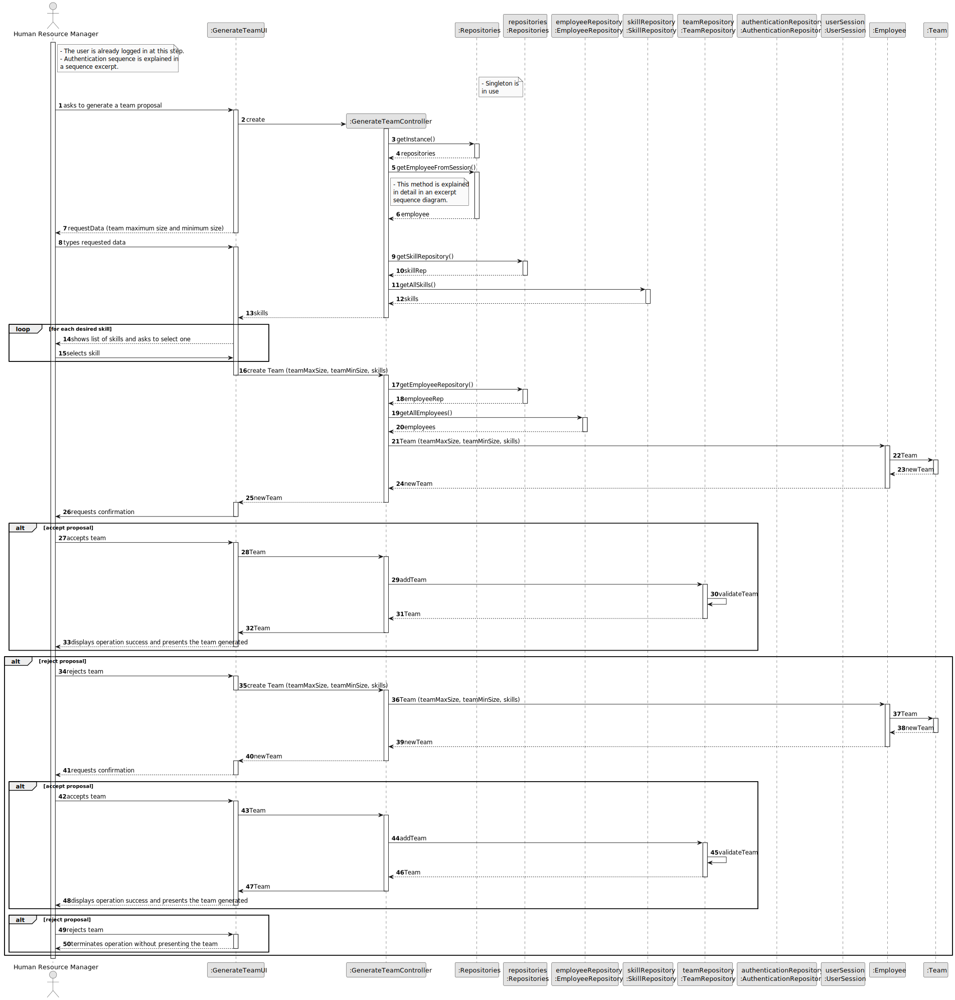
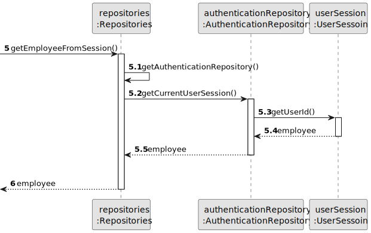
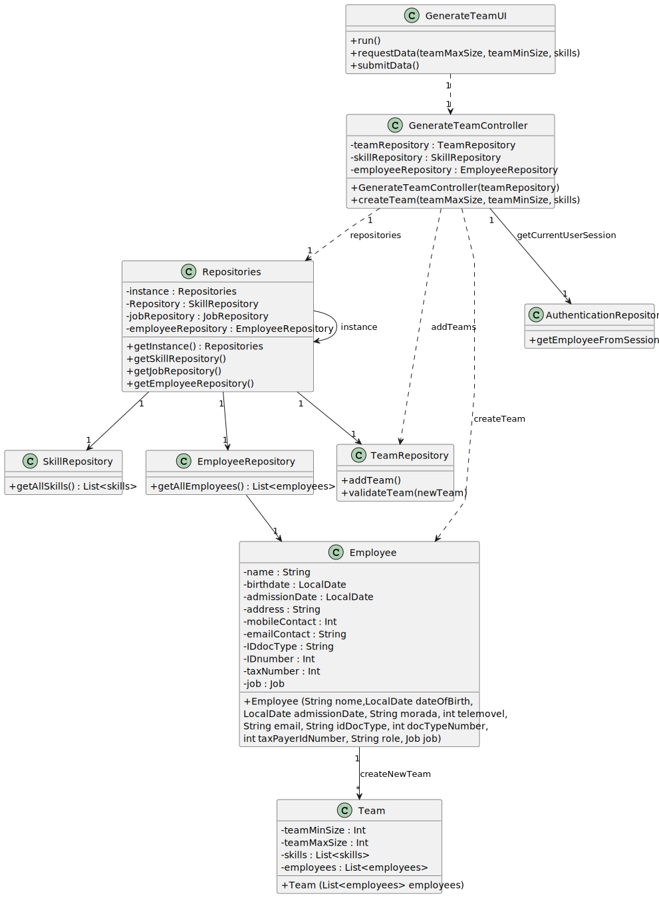

# US05 - As an HRM, I want to generate a team proposal automatically

## 3. Design - User Story Realization 

### 3.1. Rationale

_**Note that SSD - Alternative One is adopted.**_

| Interaction ID | Question: Which class is responsible for...                           | Answer                           | Justification (with patterns)                                       |
|:---------------|:----------------------------------------------------------------------|:---------------------------------|:--------------------------------------------------------------------|
| Step 1         | ... instantiating the class that handles the UI?                      | GenerateTeamUI                   | Pure Fabrication                                                    |
| Step 2         | ... coordinating the US?                                              | GenerateTeamController           | Controller                                                          |
|                | ... knowing the user using the system?                                | UserSession                      | IE: cf. A&A component documentation.                                |
|                | ... guaranteeing that only one instance is available?                 | repositories                     | Singleton                                                           |
|                | ... instantiation of repositories?                                    | GenerateTeamController           | Controller                                                          |
| Step 3         | ... ask for the actor to select data?                                 | GenerateTeamUI                   | Pure Fabrication                                                    |
| Step 4         | ... getting the list of skills?                                       | SkillRepository                  | Information Expert                                                  |
| Step 5         | ... temporarily keeping the selected skills?                          | CreateTeamUI                     | Pure Fabrication                                                    |
| Step 6         | ... displaying all the information before submitting?                 | CreateTeamUI                     | Pure Fabrication                                                    |
| Step 7         | ... obtaining the registered collaborators list?                      | Repositories, EmployeeRepository | Information Expert, Pure Fabrication                                |
|                | ... creating the Team object?                                         | Repositories, TeamRepository     | Creator R: 1                                                        |
| Step 8         | ... displaying team proposal?                                         | CreateTeamUI                     | Pure Fabrication                                                    |
| Step 9         | ... adding to a collection and globally validating duplicate records? | TeamRepository                   | Information Expert (knows all its Team instances), Pure Fabrication |
| Step 10        | ... informing operation success?                                      | CreateTeamUI                     | Pure Fabrication                                                    |
| Step 11        | ... discarding generated Team?                                        | TeamRepository                   | Creator R: 1                                                        |

### Systematization ##

According to the taken rationale, the conceptual classes promoted to software classes are: 

* Employee
* Team

Other software classes (i.e. Pure Fabrication) identified: 

* GenerateTeamUI  
* GenerateTeamController
* EmployeeRepository
* SkillRepository
* TeamRepository

## 3.2. Sequence Diagram (SD)

### Full Diagram

This diagram shows the full sequence of interactions between the classes involved in the realization of this user story.

### Split Diagrams

The following diagram shows the same sequence of interactions between the classes involved in the realization of this user story, but it is split in partial diagrams to better illustrate the interactions between the classes.

It uses Interaction Occurrence (a.k.a. Interaction Use).

**Get Employee**

## 3.3. Class Diagram (CD)

