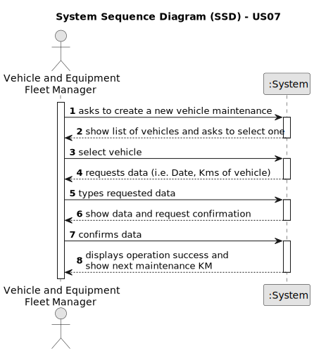

# US07 - As a VFM, I wish to register a vehicle’s maintenance.

## 1. Requirements Engineering

### 1.1. User Story Description

As an VFM, I wish to register a vehicle's maintenance with date, Kms of vehicle and Plate.

### 1.2. Customer Specifications and Clarifications 

**From the specifications document:**

>   "Vehicle and Equipment Fleet Manager (VFM) – a person who manages the fleet park, the machines, equipment and vehicles, ensuring their good condition and assigning them to the tasks to be carried out."
>   FM ensuring vehicle's good condition by sending them for check-up.

>  "US06 -  As a VFM, I wish to register a vehicle including Brand, Model, Type, Tare Weight, Gross Weight, Current Km, Register Date, Acquisition Date, and Maintenance/Check-up Frequency (in km)."
>  The registered vehicle needs to have the frequency of maintenance and the kms of the last maintenance.

**From the client clarifications:**

> **Question:** What do I need to record when checking the vehicle?
>
> **Answer:** Date, Kms of vehicle, Plate Number.

### 1.3. Acceptance Criteria

* **AC1:** A vehicle's must be chosen from the list of vehicle's available.
* **AC2:** All required fields (fields defined in topic 1.5) must be filled in.
* **AC3:** A vehicle's maintenance will be registered and a message should be displayed.

### 1.4. Found out Dependencies

* There is a dependency on "US06 -  As a VFM, I wish to register a vehicle including Brand, Model, Type, Tare Weight, Gross Weight, Current Km, Register Date, Acquisition Date, and Maintenance/Check-up Frequency (in km)." as there must be the frequency of maintenance and the kms of the last maintenance.

### 1.5 Input and Output Data

**Input Data:**

* Typed data:
    * Date
    * Kms of Vehicle
	
* Selected data:
    * Plate Number

**Output Data:**

* Message should be displayed with (in)success of the operation.
* Next maintenance Km.

### 1.6. System Sequence Diagram (SSD)

### 1.7 Other Relevant Remarks

* After the maintenance updates the vehicle data, if necessary.