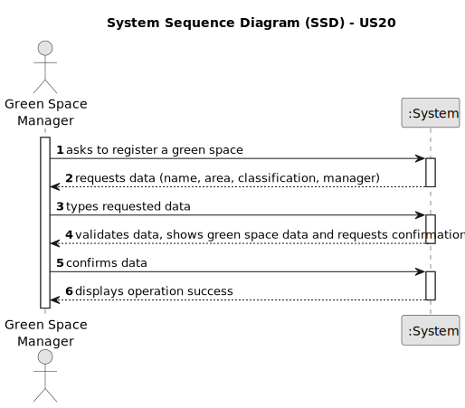

# US20 - As a Green Space Manager (GSM), I want to register a green space (garden, medium-sized park or large-sized park) and its respective area.

## 1. Requirements Engineering

### 1.1. User Story Description

As a Green Space Manager (GSM), you can register new green spaces under your care, including gardens, medium-sized parks or large parks. You can specify the type of green space and record its total area, ensuring a comprehensive inventory for optimized management.
### 1.2. Customer Specifications and Clarifications

**From the specifications document:**

>	"Green Spaces Manager (GSM) - the person responsible for managing the green spaces in charge of the organization."
>   Person who will register a green space.

>   "The green spaces for collective use, often called ”gardens” and ”parks”, are fundamental for people’s quality of life, especially in urban or semi-urban contexts."
>   Green spaces importance.

>   "The green spaces management aims (within the available budget) to design, build and maintain parks and gardens that meet the requirements of the common citizen who wants to be informed."
>   Green spaces management objective.

**From the client clarifications:**

> **Question:** What information is needed to register a green space?
>
> **Answer:** Name, Area, Address(optional), Classification(Garden, Medium Park, Large Park) and Manager.

> **Question:** Can two green spaces have the same name?
> 
> **Answer:** No.

### 1.3. Acceptance Criteria

* **AC1:** A Green Space must be registered.
* **AC2:** The Green Space Classification must be related to the Green Space Area.
* **AC3:** Multiple Green Spaces cannot have the same name.
* **AC4:** All required fields (fields defined in topic 1.5) must be filled in.

### 1.4. Found out Dependencies

* There are no dependencies.

### 1.5 Input and Output Data

**Input Data:**

* Typed data [required fields]:
    * Name
    * Area
    * Classification
    * Manager

* Typed Data [optional]:
    * Address

**Output Data:**

* Success message.

### 1.6. System Sequence Diagram (SSD)

