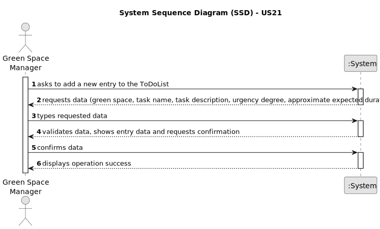

# US21 - As a GSM, I want to add a new entry to the To-Do List.

## 1. Requirements Engineering

### 1.1. User Story Description

As a Green Space Manager (GSM), this feature allows you to efficiently capture new tasks on a centralized To-Do List, streamlining your overall green space management responsibilities. This functionality ensures no critical task goes unnoticed and empowers you to prioritize and track your workload effectively.

### 1.2. Customer Specifications and Clarifications

**From the specifications document:**

>	"Green Spaces Manager (GSM) - the person responsible for managing the green spaces in charge of the organization."
>   Person who will add a new entry to the To-Do List.

>   "The To-Do List comprises all pending tasks for all parks. The entries in his list describe the required task, the degree of urgency (High, Medium, and Low), and the approximate expected duration. "
>   Definition of a To-Do List.

**From the client clarifications:**

> **Question:** In which unit should the area be measured in?
>
> **Answer:** Usually, areas are measured in hectares.

> **Question:** If there are multiple GSM in the system, can a GSM create an entry for a Green Space managed by another GSM?
>
> **Answer:** No.

> **Question:** What time unit should be used for the duration of the task?
>
> **Answer:** Hours and/or days.

> **Question:** Can the vehicles get placed automatically on a list or the one listing has to be the VFM?
>
> **Answer:** The list of vehicles is automatically created but the creation is triggered by the VFM.

### 1.3. Acceptance Criteria

* **AC1:** The new entry must be associated with a green space managed by the GSM.
* **AC2:** The green space for the new entry should be chosen from a list presented to the GSM.
* **AC3:** The To-Do List can have duplicates of the same task.
* **AC4:** The time unit used for the duration of the task must be hours and/or days.

### 1.4. Found out Dependencies

* There are no dependencies.

### 1.5 Input and Output Data

**Input Data:**

* Typed data [required fields]:
    * Green Space
    * Task name
    * Task description
    * Urgency degree
    * Approximate expected duration

**Output Data:**

* List of the tasks to do.

### 1.6. System Sequence Diagram (SSD)

