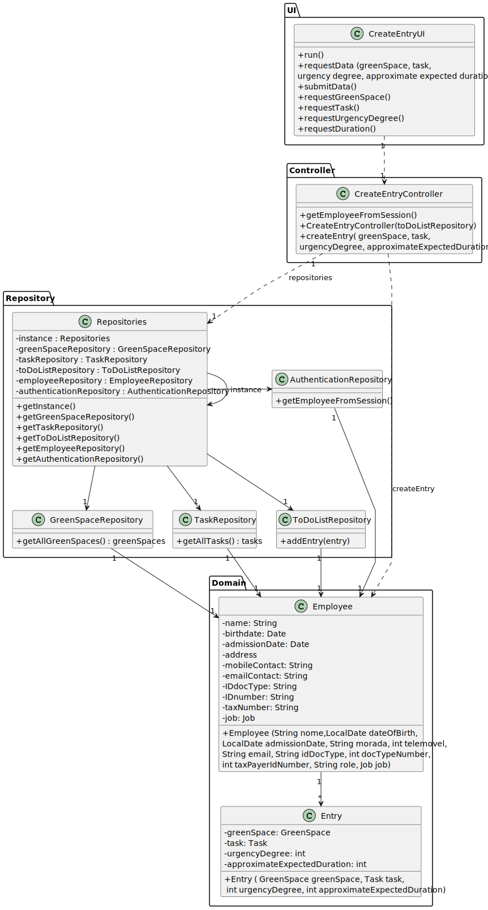

# US21 - As a GSM, I want to add a new entry to the To-Do List.

## 3. Design - User Story Realization 

### 3.1. Rationale

| Interaction ID | Question: Which class is responsible for...                    | Answer                | Justification (with patterns)           |
|:---------------|:---------------------------------------------------------------|:----------------------|:----------------------------------------|
| Step 1         | ... interacting with the actor?                                | CreateEntryUI         | Pure Fabrication                        |
|                | ... instantiating the class that handles the UI?               | CreateEntryUI         | Pure Fabrication                        |
|                | ... instantiating the controller?                              | CreateEntryUI         | Pure Fabrication                        |
|                | ... coordinating the US?                                       | CreateEntryController | Controller                              |
|                | ... guaranteeing that only one instance is available?          | repositories          | singleton                               |
|                | ... organize the repositories of the current app?              | Repositories          | Pure Fabrication                        |
|                | ... know the current logged in user?                           | UserSession           | Pure Fabrication, Information Expert    |
| Step 2         | ... getting the list of green spaces?                          | GreenSpaceRepository  | Information Expert                      |
|                | ... getting the list of tasks?                                 | TaskRepository        | Information Expert                      |
|                | ... requesting the data needed to add the entry?               | CreateEntryUI         | Pure Fabrication                        |
| Step 3         | ... display the form for the actor to input data?              | CreateEntryUI         | Pure Fabrication                        |
|                | ... temporarily keeping the input data?                        | CreateEntryUI         | Pure Fabrication                        |
|                | ... validating input data format locally?                      | CreateEntryUI         | Information Expert                      |
| Step 4         | ... showing the selected data and requesting confirmation?     | CreateEntryUI         | Pure Fabrication                        |
| Step 5         | ... display the form for the actor to input data?              | CreateEntryUI         | Pure Fabrication                        |
|                | ... temporarily keeping the input data?                        | CreateEntryUI         | Pure Fabrication                        |
|                | ... validating input data format locally?                      | CreateEntryUI         | Information Expert                      |
|                | ... adding an entry to the ToDoList?                           | Employee              | Information Expert                      |
|                | ... coordinating the US?                                       | CreateEntryController | Controller, Low coupling, High Cohesion |
|                | ... knowing the required data to add an entry to the ToDoList? | Entry                 | Information Expert                      |
|                | ... adding the new entry to the collection?                    | ToDoListRepository    | Information Expert, Pure Fabrication    |
| Step 6         | ... informing the operation success?                           | CreateEntryUI         | Pure Fabrication                        |

### Systematization ##

According to the taken rationale, the conceptual classes promoted to software classes are: 

* Entry

Other software classes (i.e. Pure Fabrication) identified: 

* CreateEntryUI  
* CreateEntryController
* GreenSpacesRepository
* TaskRepository
* ToDoListRepository

## 3.2. Sequence Diagram (SD)

### Full Diagram

This diagram shows the full sequence of interactions between the classes involved in the realization of this user story.

### Split Diagrams

The following diagram shows the same sequence of interactions between the classes involved in the realization of this user story, but it is split in partial diagrams to better illustrate the interactions between the classes.

It uses Interaction Occurrence (a.k.a. Interaction Use).

**Get Employee**

## 3.3. Class Diagram (CD)

