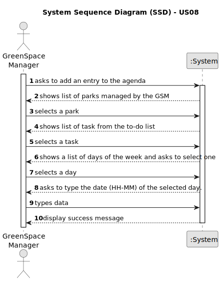

# US22 - As a GSM, I want to add a new entry in the Agenda.

## 1. Requirements Engineering

### 1.1. User Story Description

As a GSM, I want to pick a task from the to-do list and add it to the agenda for the weekly scheduling.

### 1.2. Customer Specifications and Clarifications

**From the specifications document:**

>	"Green Spaces Manager (GSM) - the person responsible for managing
the green spaces in charge of the organization."
> 
> Person responsible for adding the task to the agenda.

>  "The Agenda is a crucial mechanism for planning the week’s work."
> 
> Definition of agenda.

>  "Each entry in the Agenda defines a task (that was previously included in the to-do list).
A team will carry out that task in a green space at a certain time interval
on a specific date."
> 
> Definition of entry (task), shows the order of planning of tasks (to-do and then agenda).

>   "Comparatively analyzing the Agenda entries and the
pending tasks (to-do list) allows you to evaluate the work still to be done,
the busyness of the week, and the work performed by a team in a green space
at a determined time interval and on a specific date."
> 
> Usage of agenda

**From the client clarifications:**

> **Question:** When the GSM plans a task (that was previously in To-Do) into the Agenda, what aditional data/information does he need to input when planning?
>
> **Answer:** The starting date for the task.

### 1.3. Acceptance Criteria

* **AC1:** The new entry must be associated with a green space managed by the GSM.
* **AC2:** The new entry must exist in the To-Do list.
* **AC3:** We need to choose a date and time to add the task to the agenda.

### 1.4. Found out Dependencies

* There is a dependency on "US20 - As a Green Space Manager (GSM), I want to register a green
  space (garden, medium-sized park or large-sized park) and its respective
  area."
* There is a dependency on "US21 - As a GSM, I want to add a new entry to the To-Do List."

### 1.5 Input and Output Data

**Input Data:**
* Typed data:
    * Date (hh-mm)

* Selected data:
    * Tasks
    * Park
    * Day of the week

**Output Data:**

* Success message.

### 1.6. System Sequence Diagram (SSD)

