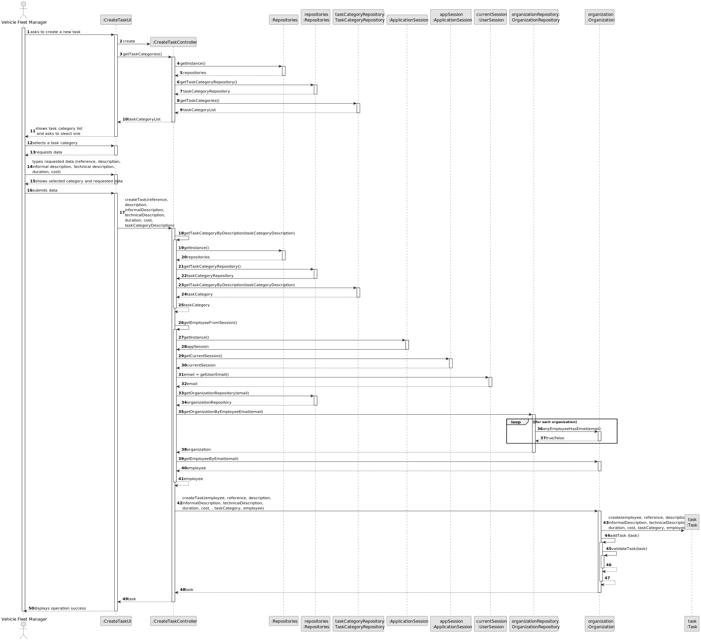
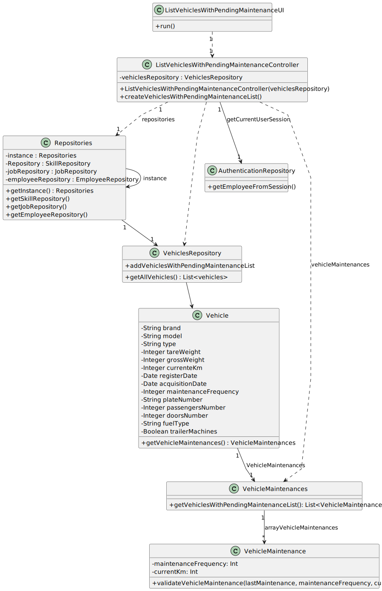

# US22 - As a GSM, I want to add a new entry in the Agenda.

## 3. Design - User Story Realization 

### 3.1. Rationale

_**Note that SSD - Alternative One is adopted.**_

| Interaction ID                                 | Question: Which class is responsible for...      | Answer                                   | Justification (with patterns)                                     |
|:-----------------------------------------------|:-------------------------------------------------|:-----------------------------------------|:------------------------------------------------------------------|
| Step 1: shows list of parks managed by the GSM | ... instantiating the class that handles the UI? | ListVehiclesPendingMaintenanceUI         | Pure Fabrication                                                  |
|                                                | ... coordinating the US?                         | ListVehiclesPendingMaintenanceController | Controller                                                        |
|                                                | ... obtaining the registered vehicles?           | Repositories,VehicleRepository           | Information Expert, Pure Fabrication                              |
|                                                | ... obtaining the vehicle to be validated?       | Vehicle                                  | Information Expert (knows all its attributes)                     |
|                                                | ... validating if the vehicle needs check-up?    | Maintenances                             | GRASP, Low Coupling, Promotion of Collections to Software Classes |
| Step 2: selects a park                         | ... displaying vehicle's in need for a check-up? | ListVehiclesPendingMaintenanceUI         | Pure Fabrication                                                  |
| Step 3: shows list of task from the to-do list | ... displaying vehicle's in need for a check-up? | ListVehiclesPendingMaintenanceUI         | Pure Fabrication                                                  |
| Step 4: selects a task                         | ... displaying vehicle's in need for a check-up? | ListVehiclesPendingMaintenanceUI         | Pure Fabrication                                                  |
| Step 5: Asks to select the urgency degree      | ... displaying vehicle's in need for a check-up? | ListVehiclesPendingMaintenanceUI         | Pure Fabrication                                                  |
| Step 6: selects an urgency degree              | ... displaying vehicle's in need for a check-up? | ListVehiclesPendingMaintenanceUI         | Pure Fabrication                                                  |
| Step 7: asks to type the duration of the task  | ... displaying vehicle's in need for a check-up? | ListVehiclesPendingMaintenanceUI         | Pure Fabrication                                                  |
| Step 8: types duration                         | ... displaying vehicle's in need for a check-up? | ListVehiclesPendingMaintenanceUI         | Pure Fabrication                                                  |
| Step 9: display success message                | ... displaying vehicle's in need for a check-up? | ListVehiclesPendingMaintenanceUI         | Pure Fabrication                                                  |

### Systematization ##

According to the taken rationale, the conceptual classes promoted to software classes are: 

* Vehicle
* VehicleMaintenance

Other software classes (i.e. Pure Fabrication) identified: 

* ListVehiclesPendingMaintenanceUI  
* ListVehiclesPendingMaintenanceController
* VehicleRepository

## 3.2. Sequence Diagram (SD)

### Full Diagram

This diagram shows the full sequence of interactions between the classes involved in the realization of this user story.

### Split Diagrams

The following diagram shows the same sequence of interactions between the classes involved in the realization of this user story, but it is split in partial diagrams to better illustrate the interactions between the classes.

It uses Interaction Occurrence (a.k.a. Interaction Use).

**Get Employee**

## 3.3. Class Diagram (CD)

