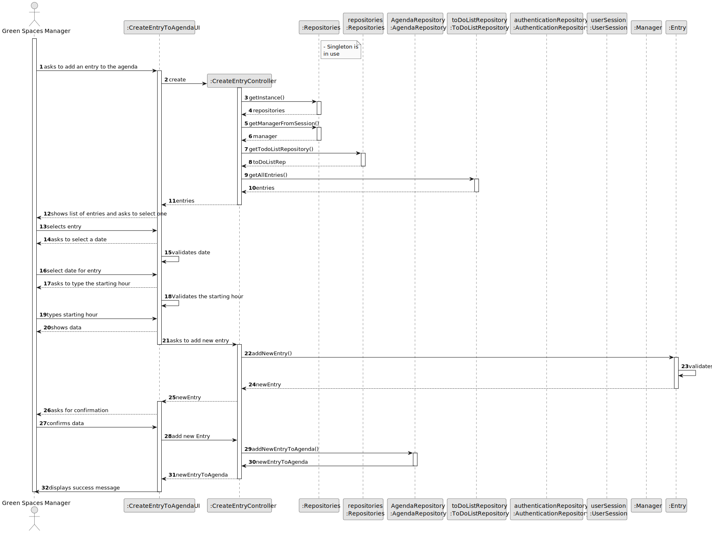

# US22 - As a GSM, I want to add a new entry in the Agenda.

## 3. Design - User Story Realization 

### 3.1. Rationale

_**Note that SSD - Alternative One is adopted.**_

| Interaction ID                                      | Question: Which class is responsible for...               | Answer                        | Justification (with patterns) |
|:----------------------------------------------------|:----------------------------------------------------------|:------------------------------|:------------------------------|
| Step 1: asks to add an entry to the agenda          | ... instantiating the class that handles the UI?          | CreateEntryToAgendaUI         | Pure Fabrication              |
|                                                     | ... coordinating the US?                                  | CreateEntryToAgendaController | Controller                    |
|                                                     | ... guaranteeing that only one instance is available?     | repositories                  | singleton                     |
|                                                     | ... instantiation of repositories?                        | CreateEntryToAgendaController | Controller                    |
| Step 2: shows list of entries and ask to select one | ... getting the list of entries?                          | ToDoListRepository            | Information Expert            |
|                                                     | ... ask for the actor to select data?                     | CreateEntryToAgendaUI         | Pure Fabrication              |
| Step 3: asks to select a date                       | ... ask for the actor to select data?                     | CreateEntryToAgendaUI         | Information Expert            |
| Step 5: asks to select an urgency degree            | ... ask for the actor to select data?                     | CreateEntryToAgendaUI         | Pure Fabrication              |
| Step 6: asks to type the duration                   | ... ask for the actor to type data?                       | CreateEntryToAgendaUI         | Pure Fabrication              |
| Step 7: shows data and asks for confirmation        | ... validating data before adding entry (mandatory data)? | Entry                         | Information Expert            |
|                                                     | ... adding an Entry and validating data?                  | AgendaRepository              | Information Expert            |
| Step 7: display success message                     | ... informing the operation success?                      | CreateEntryToAgendaUI         | Pure Fabrication              |

### Systematization ##

According to the taken rationale, the conceptual classes promoted to software classes are: 

* Entry

Other software classes (i.e. Pure Fabrication) identified: 

* AgendaRepository

## 3.2. Sequence Diagram (SD)

### Full Diagram

This diagram shows the full sequence of interactions between the classes involved in the realization of this user story.

## 3.3. Class Diagram (CD)

