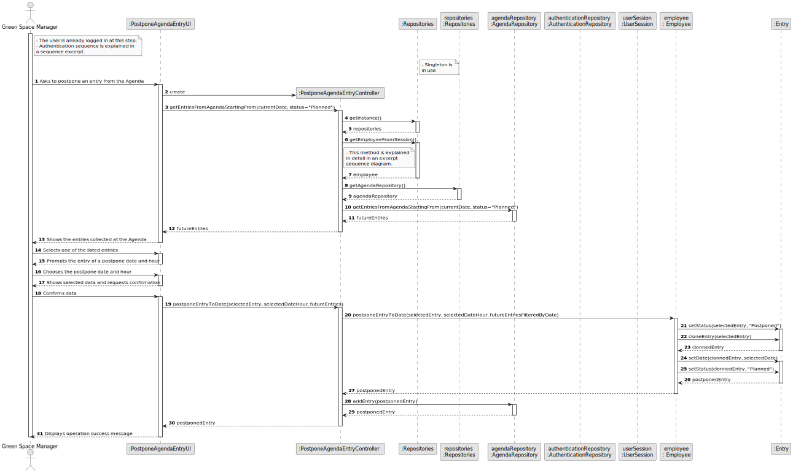

# US24 - As a GSM, I want to Postpone an entry in the Agenda to a specific future date.

## 3. Design - User Story Realization 

### 3.1. Rationale

_**Note that SSD - Alternative One is adopted.**_

| Interaction ID | Question: Which class is responsible for...                                              | Answer                        | Justification (with patterns)                                                                                                                                      |
|:---------------|:-----------------------------------------------------------------------------------------|:------------------------------|:-------------------------------------------------------------------------------------------------------------------------------------------------------------------|
| Step 1         | ... interacting with the actor                                                           | PostponeAgendaEntryUI         | There is no reason to assign this responsibility to any existing class in the Domain Model (Pure Fabrication)                                                      |
|                | ... instantiating the class that handles the UI?                                         | PostponeAgendaEntryUI         | There is no reason to assign this responsibility to any existing class in the Domain Model (Pure Fabrication)                                                      |
|                | ... coordinating the US?                                                                 | PostponeAgendaEntryController | Ensures decoupling between the UI layer and the Domain layer. (Controller, Low coupling, High Cohesion)                                                            |
|                | ... instantiating the controller                                                         | PostponeAgendaEntryUI         | There is no reason to assign this responsibility to any existing class in the Domain Model (Pure Fabrication)                                                      |
|                | ... organize the repositories of the current app?                                        | Repositories                  | There is no reason for other class to have this responsibility. Aggregates all the repositories. (Pure Fabrication)                                                |
|                | ... know the current logged in user?                                                     | UserSession                   | There is no reason for other class to have this responsibility. Has in itself the instance of the Authentication Repository (Pure Fabrication, Information Expert) |
|                | ... knowing all the Agenda Entries and filter by criteria?                               | AgendaRepository              | Knows all the Agenda Entries instances (Information Expert, Pure Fabrication)                                                                                      |
| Step 2         | ... showing the entries collected at the Agenda and prompting the selection of an entry? | PostponeAgendaEntryUI         | Interaction with the user (Pure Fabrication)                                                                                                                       |
| Step 3         | ... display the form for the actor to input data?                                        | PostponeAgendaEntryUI         | Interaction with the user, there is no reason for other class to have this responsibility (Pure Fabrication)                                                       |
|                | ... temporarily keeping the input data?                                                  | PostponeAgendaEntryUI         | Before passing the data to the PostponeAgendaEntryController for further coordination (Pure Fabrication)                                                           |
|                | ... validating  input data format locally?                                               | PostponeAgendaEntryUI         | Should be responsible for validating the input data format (Information Expert)                                                                                    |
| Step 4         | ... prompting the entry of a postpone date and hour?                                     | PostponeAgendaEntryUI         | Ensures decouple between the UI layer and the Domain layer. Answers the UI requests. (Controller, Low coupling, High Cohesion)                                     |
| Step 5         | ... display the form for the actor to input data?                                        | PostponeAgendaEntryUI         | Interaction with the user, there is no reason for other class to have this responsibility (Pure Fabrication)                                                       |
|                | ... temporarily keeping the input data?                                                  | PostponeAgendaEntryUI         | Before passing the data to the PostponeAgendaEntryController for further coordination (Pure Fabrication)                                                           |
|                | ... validating  input data format locally?                                               | PostponeAgendaEntryUI         | Should be responsible for validating the input data format (Information Expert)                                                                                    |
| Step 6         | ... showing the selected data end requesting confirmation?                               | PostponeAgendaEntryUI         | Interaction with the user (Pure Fabrication)                                                                                                                       |
| Step 7         | ... display the form for the actor to input data?                                        | PostponeAgendaEntryUI         | Interaction with the user, there is no reason for other class to have this responsibility (Pure Fabrication)                                                       |
|                | ... temporarily keeping the input data?                                                  | PostponeAgendaEntryUI         | Before passing the data to the PostponeAgendaEntryController for further coordination (Pure Fabrication)                                                           |
|                | ... validating  input data format locally?                                               | PostponeAgendaEntryUI         | Should be responsible for validating the input data format (Information Expert)                                                                                    |
|                | ... coordinating the US?                                                                 | PostponeAgendaEntryController | Ensures decoupling between the UI layer and the Domain layer. (Controller, Low coupling, High Cohesion)                                                            |
|                | ... postponing the Agenda Entry?                                                         | Employee                      | In the domain model the Employee, as a GSM, is the responsible for managing the Agenda (Information Expert)                                                        |
|                | ... knowing the required data to postpone an Entry?                                      | Entry                         | Knows its own data (Information Expert)                                                                                                                            |
|                | ... adding the new postponed Entry to the collection?                                    | AgendaRepository              | Knows all the Skill instances (Information Expert, Pure Fabrication)                                                                                               |
| Step 8         | ... informing the operation success?                                                     | PostponeAgendaEntryUI         | Interaction with the user (Pure Fabrication)                                                                                                                       |
 

### Systematization ##

According to the taken rationale, the conceptual classes promoted to software classes are: 

* Agenda
* Employee

Other software classes (i.e. Pure Fabrication) identified: 

* PostponeAgendaEntryUI
* PostponeAgendaEntryController
* AgendaRepository

## 3.2. Sequence Diagram (SD)

### Full Diagram

This diagram shows the full sequence of interactions between the classes involved in the realization of this user story.

### Split Diagrams

The following diagram shows the same sequence of interactions between the classes involved in the realization of this user story, but it is split in partial diagrams to better illustrate the interactions between the classes.

It uses Interaction Occurrence (a.k.a. Interaction Use).

**Get Employee**

## 3.3. Class Diagram (CD)

