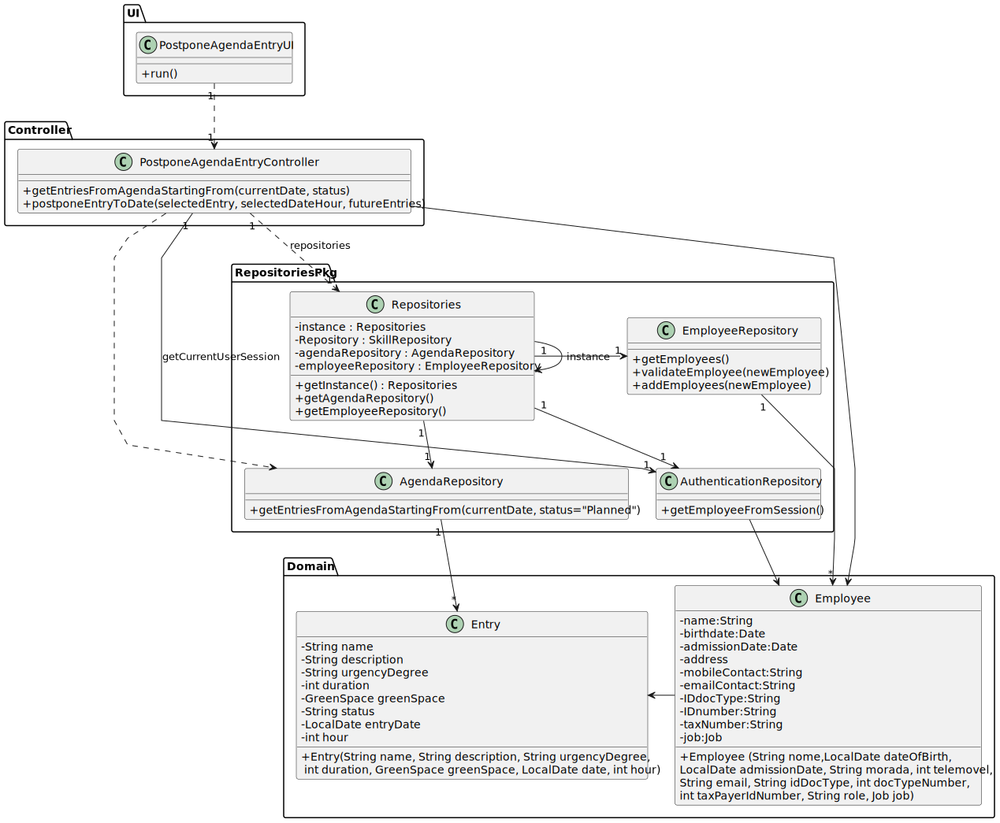

# US24 - As a GSM, I want to Postpone an entry in the Agenda to a specific future date.

## 3. Design - User Story Realization 

### 3.1. Rationale

_**Note that SSD - Alternative One is adopted.**_

| Interaction ID | Question: Which class is responsible for...     | Answer | Justification (with patterns) |
|:---------------|:------------------------------------------------|:-------|:------------------------------|
| Step 1: ...    | ...                                             | ...    | ...                           |

### Systematization ##

According to the taken rationale, the conceptual classes promoted to software classes are: 

* 

Other software classes (i.e. Pure Fabrication) identified: 

* 

## 3.2. Sequence Diagram (SD)

### Full Diagram

This diagram shows the full sequence of interactions between the classes involved in the realization of this user story.

### Split Diagrams

The following diagram shows the same sequence of interactions between the classes involved in the realization of this user story, but it is split in partial diagrams to better illustrate the interactions between the classes.

It uses Interaction Occurrence (a.k.a. Interaction Use).

**Get Employee**

## 3.3. Class Diagram (CD)

