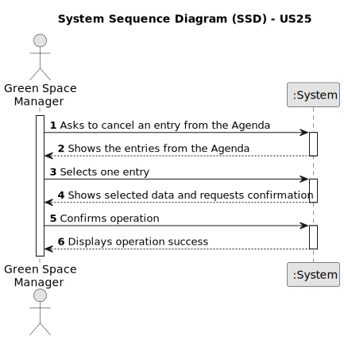

# US25 - As a GSM, I want to Cancel an entry in the Agenda.

## 1. Requirements Engineering

### 1.1. User Story Description

As a GSM, I want to Cancel an entry in the Agenda that is no longer required.

### 1.2. Customer Specifications and Clarifications

**From the specifications document:**

>   "The Agenda is a crucial mechanism for planning the week’s work. Each entry in the Agenda defines a task (that was previously included in the to-do list)."

>   "A team will carry out that task in a green space at a certain time interval on a specific date."

>   "Comparatively analyzing the Agenda entries and the pending tasks (to-do list) allows you to evaluate the work still to be done, the busyness of the week, and the work performed by a team in a green space at a determined time interval and on a specific date."

>   "US22-AsaGSM,I want to add a new entry in the Agenda."

>   "US23 - As a GSM, I want to assign a Team to an entry in the Agenda."

>   "US24 - As a GSM, I want to Postpone an entry in the Agenda to a future date."

>   "US26 - As a GSM, I want to assign one or more vehicles to an entry in the Agenda."

**From the client clarifications:**

> **Question:** Should the cancelled be deleted from the agenda? 
>
> **Answer:** No. The entry should remain, however, it's status should be altered to "Canceled".

### 1.3. Acceptance Criteria

* **AC1:** A canceled task should not be deleted but rather change its state. 
* **AC2:** 
* **AC3:** The selected entry should be canceled.

### 1.4. Found out Dependencies

* There are dependencies with the:

    * "US21-As a GSM,I want to add a new entry to the To-DoList." - There need to be entries in the "To-Do List" in order for the to be migrated to the "Agenda".
    * "US22 - As a GSM, I want to add a new entry in the Agenda." - An entry (task) shoud be effectively planned in the "Agenda".

### 1.5 Input and Output Data

**Input Data:**

* No data input is required.

**Output Data:**

* Confirmation of the selected data.
* Message of operation success 

### 1.6. System Sequence Diagram (SSD)

