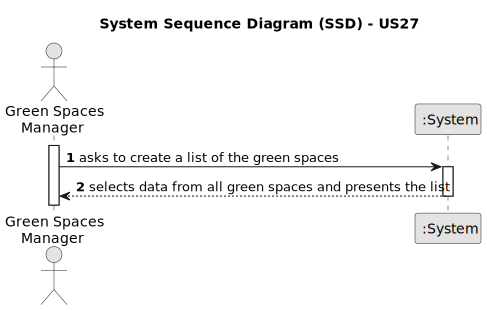

# US27 - As a GSM, I need to list all green spaces managed by me.

## 1. Requirements Engineering

### 1.1. User Story Description

As a green space manager, I need to list all the green spaces managed by me, so that I can easily view and manage the areas under my responsibility.

### 1.2. Customer Specifications and Clarifications

**From the specifications document:**

>	"Green Spaces Manager (GSM) - the person responsible for managing the green spaces in charge of the organization."
>   Person who will list the green spaces.

**From the client clarifications:**

> **Question:** 
>
> **Answer:** 

### 1.3. Acceptance Criteria

* **AC1:** The list of green spaces must be sorted by size in descending order. The sorting algorithm to be used by the application must be defined through a configuration file. At least two sorting algorithms should be available.
* **AC2:** 

### 1.4. Found out Dependencies

* There is a dependency 

### 1.5 Input and Output Data

**Input Data:**

No input data needed.

**Output Data:**

* List of the green spaces.

### 1.6. System Sequence Diagram (SSD)

