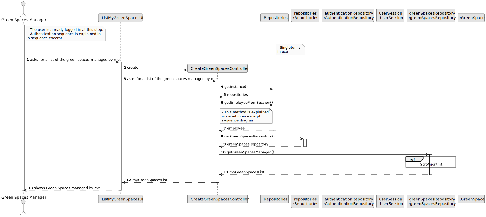
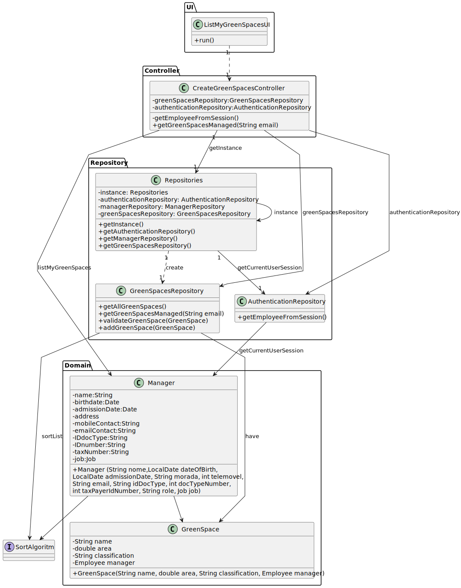

# US27 - As a GSM, I need to list all green spaces managed by me.

## 3. Design - User Story Realization 

### 3.1. Rationale

_**Note that SSD - Alternative One is adopted.**_

| Interaction ID                                            | Question: Which class is responsible for...      | Answer                      | Justification (with patterns)            |
|:----------------------------------------------------------|:-------------------------------------------------|:----------------------------|:-----------------------------------------|
| Step 1: asks for a list of the green spaces managed by me | ... instantiating the class that handles the UI? | ListMyGreenSpacesUI         | Pure Fabrication                         |
|                                                           | ... coordinating the US?                         | CreateGreenSpacesController | Controller                               |
|                                                           | ... knowing the user using the system?           | UserSession                 | IE: cf. A&A component documentation.     |
|                                                           |                                                  | Organization                | IE: knows/has its own Employees          |
|                                                           |                                                  | Employee                    | IE: knows its own data (e.g. email)      |
|                                                           | ... obtaining the green spaces list?             | GreenSpacesRepository       | Information Expert, Protected Variations |
| Step 2: presents a list of all green spaces managed by me | ... displaying green spaces managed by me?       | ListMyGreenSpacesUI         | Pure Fabrication                         |

### Systematization ##

According to the taken rationale, the conceptual classes promoted to software classes are: 

* Organization
* Manager
* GreenSpace

Other software classes (i.e. Pure Fabrication) identified: 

* ListMyGreenSpacesUI  
* CreateGreenSpacesController
* GreenSpaceRepository

## 3.2. Sequence Diagram (SD)

### Full Diagram

This diagram shows the full sequence of interactions between the classes involved in the realization of this user story.

### Split Diagrams

The following diagram shows the same sequence of interactions between the classes involved in the realization of this user story, but it is split in partial diagrams to better illustrate the interactions between the classes.

It uses Interaction Occurrence (a.k.a. Interaction Use).

**Get Employee**

## 3.3. Class Diagram (CD)

