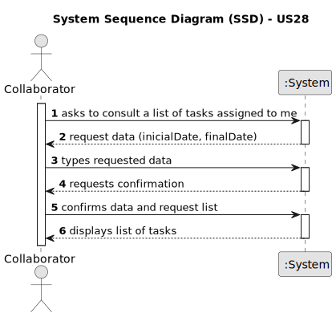

# US28 - As a Collaborator, I wish to consult the tasks assigned to me between two dates.

## 1. Requirements Engineering

### 1.1. User Story Description

As a collaborator, I wish to consult the tasks assigned to me between two dates, so that I can manage my work.

### 1.2. Customer Specifications and Clarifications

**From the specifications document:**

>   "Collaborator – a person who is an employee in the organization and carries out design, construction and/or maintenance tasks for green areas, depending on their skills."
>   Person who will do consult the tasks.

**From the client clarifications:**

> **Question:** What tasks should be presented?
>
> **Answer:** List past, present and future tasks.

### 1.3. Acceptance Criteria

* **AC1:** The list of green spaces must be sorted by date.
* **AC2:** The Collaborator should be able to filter the results by the status of the task.
* **AC3:** All required fields must be filed in (i.e. Initial Date, Final Date).
* 
### 1.4. Found out Dependencies

* There is a dependency on "US05 - As an HRM, I want to generate a team proposal automatically" as we need to belong to a team. 
* There is a dependency on "US23 - As a GSM, I want to assign a Team to an entry in the Agenda." to have tasks assigned to the team we belong to.

### 1.5 Input and Output Data

**Input Data:**

* Typed data:
    * Initial Date
    * Final Date

**Output Data:**

* List of tasks assigned to collaborator.

### 1.6. System Sequence Diagram (SSD)

