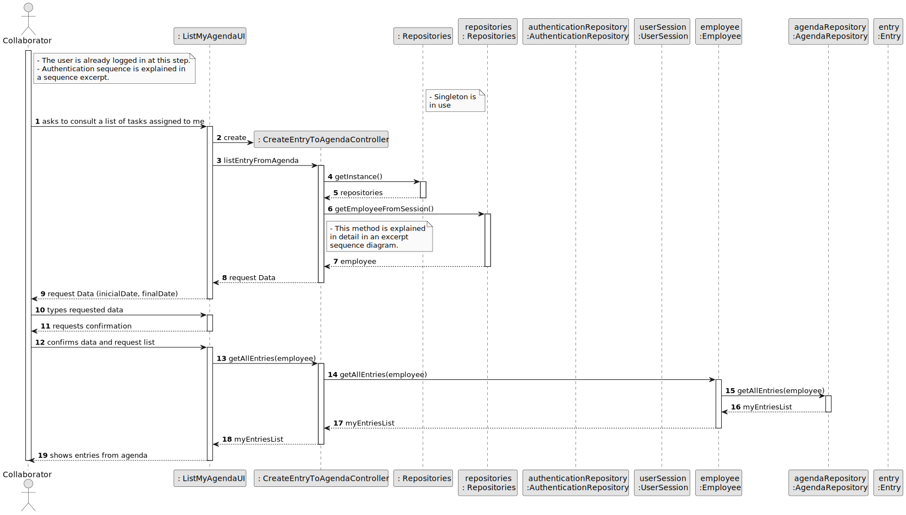
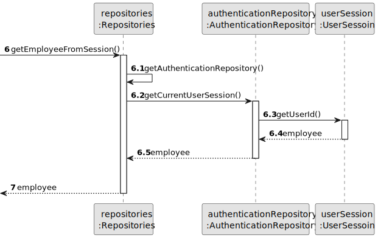
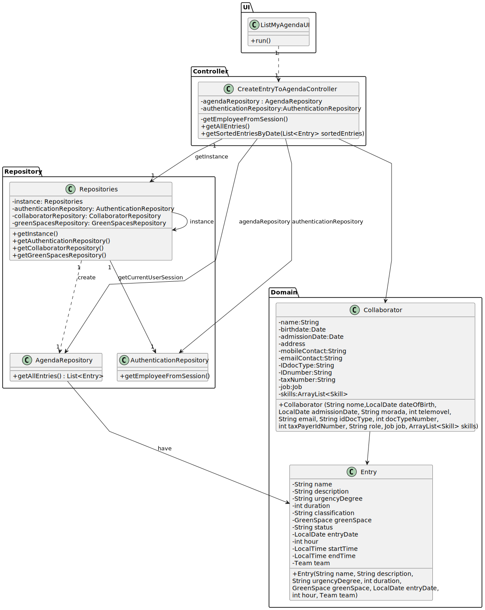

# US28 - As a Collaborator, I wish to consult the tasks assigned to me between two dates.

## 3. Design - User Story Realization 

### 3.1. Rationale

| Interaction ID                                         | Question: Which class is responsible for...           | Answer                                   | Justification (with patterns)                                     |
|:-------------------------------------------------------|:------------------------------------------------------|:-----------------------------------------|:------------------------------------------------------------------|
| Step 1: asks to consult a list of tasks assigned to me | ... instantiating the class that handles the UI?      | ListMyAgendaUI                           | Pure Fabrication                                                  |
|                                                        | ... coordinating the US?                              | CreateEntryToAgendaController            | Controller                                                        |
|                                                        | ... knowing the user using the system?                | UserSession                              | IE: cf. A&A component documentation.                              |
|                                                        |                                                       | Organization                             | IE: knows/has its own Employees                                   |
|                                                        |                                                       | Employee                                 | IE: knows its own data (e.g. email)                               |
| Step 2: request data (inicialDate, finalDate)          | ... display the form for the actor to input data?     | ListMyAgendaUI                           | Pure Fabrication                                                  |
| Step 3: types requested data                           | ... validating the inputted data?                     | ListMyAgendaUI                           | Pure Fabrication                                                  |
|                                                        | ... temporarily keeping the input data?               | ListMyAgendaUI                           | Pure Fabrication                                                  |
| Step 4: requests confirmation                          | ... displaying all the information before submitting? | ListMyAgendaUI                           | Pure Fabrication                                                  |
| Step 5: confirms data and request list                 | ... coordinating the US?                              | ListVehiclesPendingMaintenanceController | Controller                                                        |
|                                                        | ... obtaining the registered entries?                 | Repositories,AgendaRepository            | Information Expert, Pure Fabrication                              |
| Step 6: displays list of tasks                         | ... informing the operation success?                  | ListMyAgendaUI                           | Pure Fabrication                                                  |

### Systematization ##

According to the taken rationale, the conceptual classes promoted to software classes are: 

* Entry

Other software classes (i.e. Pure Fabrication) identified: 

* ListMyAgendaUI  
* CreateEntryToAgendaController
* AgendaRepository

## 3.2. Sequence Diagram (SD)

### Full Diagram

This diagram shows the full sequence of interactions between the classes involved in the realization of this user story.

### Split Diagrams

The following diagram shows the same sequence of interactions between the classes involved in the realization of this user story, but it is split in partial diagrams to better illustrate the interactions between the classes.

It uses Interaction Occurrence (a.k.a. Interaction Use).

**Get Employee**

## 3.3. Class Diagram (CD)

