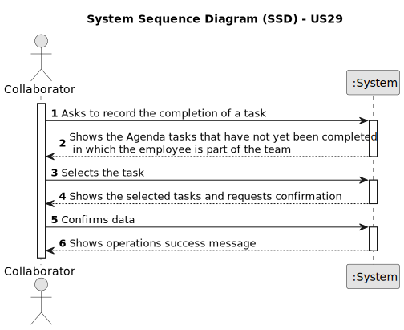

# US29 - As a Collaborator, I want to record the completion of a task.

## 1. Requirements Engineering

### 1.1. User Story Description

As a Collaborator, I want to record the completion of a task that might have been attributed to me or my team.

### 1.2. Customer Specifications and Clarifications

**From the specifications document:**

> "Tasks are carried out on an occasional or regular basis, in one or more green spaces, for example: tree pruning, installation of an irrigation system, and installation of a lighting system."

> "Teams are temporary associations of employees who will carry out a determined set of tasks in one or more green spaces. When creating multipurpose teams, the number of members and the set of skills that must be covered are crucial."

> "The Agenda is a crucial mechanism for planning the week’s work. Each entry in the Agenda defines a task (that was previously included in the to-do list). A team will carry out that task in a green space at a certain time interval on a specific date."

> "... analyzing the Agenda entries and the pending tasks (to-do list) allows you to evaluate the work still to be done, the busyness of the week, and the work performed by a team in a green space at a determined time interval and on a specific date."
 
> "Collaborator – a person who is an employee in the organization and carries out design, construction and/or maintenance tasks for green areas, depending on their skills."
 
> "US05 - As an HRM, I want to generate a team proposal automatically."

> "US23 - As a GSM, I want to assign a Team to an entry in the Agenda."

**From the client clarifications:**

> **Question:** 
>
> **Answer:** 

### 1.3. Acceptance Criteria

* **AC1:** The Collaborator may only choose between the tasks that are not yet completed.
* **AC2:** The Collaborator may only choose between the tasks in which he is part of the team.
* **AC3:** A task should be completed.

### 1.4. Found out Dependencies

* There is a dependency on "US06 - As a VFM, I wish to register a vehicle including Brand, Model, Type, Tare, Gross Weight, Current Km, Register Date, Acquisition Date, Maintenance/Checkup Frequency (in Kms)." as we need to know which vehicles are registered and their information to know which vehicles we need to list for the check-up.
* There is a dependency on "US07 - As a VFM, I wish to register a vehicle’s check-up." as we need to list the vehicles that have a check-up registered from the overall vehicles.

### 1.5 Input and Output Data

**Input Data:**

No input data needed.

**Output Data:**

* List of the vehicles needing maintenance.

### 1.6. System Sequence Diagram (SSD)

